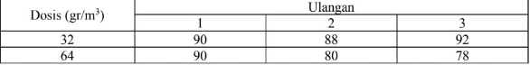
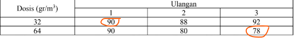
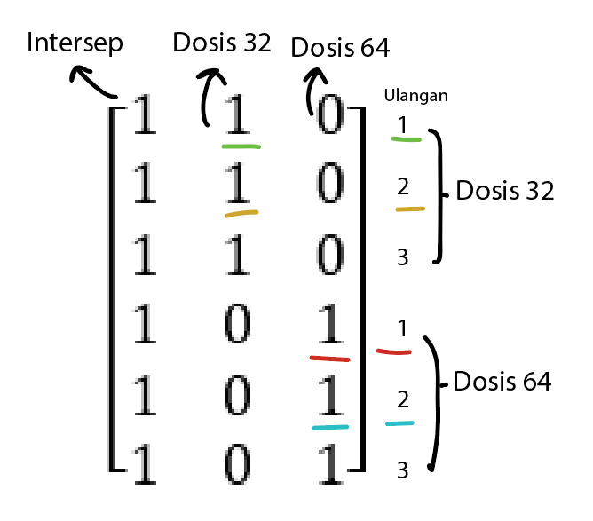

```{=html}
<style>
.centered-text {
  text-align: center;
}
</style>
```
```{r setup, warning=FALSE, include=FALSE, message = FALSE}
#                      -=( Install & Load Package Function )=-
install_load <- function (package1, ...)  {   

   # convert arguments to vector
   packages <- c(package1, ...)

   # start loop to determine if each package is installed
   for(package in packages){

       # if package is installed locally, load
       if(package %in% rownames(installed.packages()))
          do.call('library', list(package))

       # if package is not installed locally, download, then load
       else {
          install.packages(package)
          do.call("library", list(package))
       }
   } 
}

install_load('officedown','officer','tidyverse')

knitr::opts_chunk$set(
  echo=FALSE,
  #Table Captioning
  tab.cap.style="Table Caption",
  tab.cap.pre="Tabel ",
  tab.cap.sep=": ",
  #Figure Captioning
  fig.cap.style="Image Caption",
  fig.cap.pre="Figure ",
  fig.cap.sep=": "
)

rdocx_document(
  base_format = "rmarkdown::word_document",
  reference_num = FALSE
)
```

$$
\text{ }
$$

$$
\text{ }
$$

$$
\text{ }
$$

$$
\text{ }
$$

{width="729"}

$$
\text{ }
$$

$$
\text{ }
$$

$\text{ }\text{ }\text{ }\text{ }\text{ }\text{ }\text{ }\text{ }\text{ }\text{ }\text{ }\text{ }\text{ }\text{ }\text{ }\text{ }\text{ }\text{ }\text{ }\text{ }\text{ }\text{ }\text{ }\text{ }\text{ }\text{ }\text{ }\text{ }\text{ }\text{ }\text{ }\text{ }\text{ }\text{ }\text{ }\text{ }\text{ }\text{ }\text{ }\text{ }\text{ }\text{ }\text{ }\text{ }$

$$
\text{ }
$$

$$
\textbf{DEPARTEMEN STATISTIKA DAN SAINS DATA}
$$

$$
\textbf{FAKULTAS ILMU PENGETAHUAN ALAM}
$$

$$
\textbf{IPB UNIVERSITY}
$$

$$
\textbf{2023}
$$

\newpage

## Daftar Isi

```{r, echo=FALSE}
block_toc()
```

\newpage

# Soal no 1

Misalkan $y_1,\ldots,y_6$ merupakan hasil produksi yang dilakukan enam hari berturut-turut dengan menggunakan dua mesin. `Mesin A` digunakan pada hari ke 1, 3, dan 5 sedangkan `Mesin B` digunakan pada hari ke 2, 4 dan 6. Dengan asumsi $E(\varepsilon_i)=0$ dan $Var(\varepsilon_i)=\sigma^2$. Data hasil produksi berturut-turut adalah $8.95, 5.81, 7.81, 7.30, 7.50,$ dan $7.60$. Tentukan :

## Point (a)

> Susunlah **model linier**nya dalam bentuk **matriks** dan **persamaan normal** dari rancangan diatas, lengkapi dengan **keterangan** yang jelas.

**Persamaan dalam bentuk Matriks**

$$
y = \mathbf{X}\beta + \varepsilon
$$

$$
\begin{bmatrix} y_{11} \\ y_{12} \\ y_{13} \\ y_{21} \\ y_{23} \\ y_{23} \end{bmatrix} = \begin{bmatrix} 1 & 1 & 0 \\  1 & 1 & 0 \\ 1 & 1 & 0 \\ 1 & 0 & 1 \\ 1 & 0 & 1 \\ 1 & 0 & 1 \\ \end{bmatrix} \begin{bmatrix} \mu \\ \tau_1 \\ \tau_2 \end{bmatrix} + \begin{bmatrix} \varepsilon_{11} \\ \varepsilon_{12} \\ \varepsilon_{13} \\ \varepsilon_{21} \\ \varepsilon_{23} \\ \varepsilon_{23} \end{bmatrix}
$$

$$
\begin{bmatrix} 8.95 \\ 7.81 \\ 7.5 \\ 5.81 \\ 7.30 \\ 7.60 \\ \end{bmatrix} = \begin{bmatrix} 1 & 1 & 0 \\  1 & 1 & 0 \\ 1 & 1 & 0 \\ 1 & 0 & 1 \\ 1 & 0 & 1 \\ 1 & 0 & 1 \\ \end{bmatrix} \begin{bmatrix} \mu \\ \tau_1 \\ \tau_2 \end{bmatrix} + \begin{bmatrix} \varepsilon_{11} \\ \varepsilon_{12} \\ \varepsilon_{13} \\ \varepsilon_{21} \\ \varepsilon_{23} \\ \varepsilon_{23} \end{bmatrix}
$$

Dimana :

-   $y$ : vektor respons

-   $\mathbf{X}$ : matriks rancangan

-   $\beta$ : vektor parameter

-   $\varepsilon$ : vektor galat

**Persamaan normal**

$$
y_{ij} = \mu + \tau_i + \varepsilon_{ij} \text{ } ; \text{ } i = 1, 2 \text{ dan } j=1,2,3
$$

Dimana :

-   $y_{ij}$ : respons perlakuan (pada perlakuan ke-$i$ dan ulangan ke-$j$ )

-   $\mu$ : rataan umum

-   $\tau_i$ : pengaruh perlakuan (pada perlakuan ke-$i$ )

-   $\varepsilon_{ij}$ : pengaruh acak (pada perlakuan ke-$i$ dan ulangan ke-$j$ )

```{r, include=FALSE}
y <- c(8.95, 7.81, 7.5, 5.81, 7.3, 7.6)
X <- matrix(c(1, 1, 0,
              1, 1, 0,
              1, 1, 0,
              1, 0, 1,
              1, 0, 1,
              1, 0, 1), 6, 3, T)
n <- nrow(X)
```

## Point (b)

> Hitunglah **penduga kuadrat terkecil** bagi beda pengaruh `Mesin A` dan `Mesin B`.

**Hasil dari R**

```{r message=FALSE, warning=FALSE}
#X'X
tXX <- t(X) %*% X; cat("X'X :\n"); tXX

#(X'X)^c
install_load("MASS")
M1 <- matrix(c(3, 0, 
               0, 3), 2,2,T)
tXX.c1 <- matrix(0, nrow = 3, ncol = 3)
tXX.c1[2:3, 2:3] <- t(solve(M1))
cat("\n(X'X)^c :\n"); fractions(tXX.c1)

#X'y 
tXy <- t(X) %*% y; cat("\nX'y :\n"); tXy

#Beta
Beta <- tXX.c1 %*% tXy; cat("\nBeta :\n"); Beta
```

**Dalam Latex**

$$
\begin{equation}
\begin{aligned}
\mathbf{X}'\mathbf{X} &= \begin{bmatrix} 6 & 3 & 3 \\ 3 & 3 & 0 \\ 3 & 0 & 3 \\ \end{bmatrix} \\ \\ (\mathbf{X}'\mathbf{X})^c &= \begin{bmatrix} 0 & 0 & 0 \\ 0 & \frac{1}{3} & 0 \\ 0 & 0 & \frac{1}{3} \\ \end{bmatrix} \\ \\ \mathbf{X}'\mathbf{y} &= \begin{bmatrix} 44.97 \\ 24.26 \\ 20.71 \\\end{bmatrix} \\ \\ \beta &= (\mathbf{X}'\mathbf{X})^c \mathbf{X}'\mathbf{y} \\ &= \begin{bmatrix} 0 & 0 & 0 \\ 0 & \frac{1}{3} & 0 \\ 0 & 0 & \frac{1}{3} \\ \end{bmatrix}  \begin{bmatrix} 44.97 \\ 24.26 \\ 20.71 \\ \end{bmatrix} \\ &= \begin{bmatrix} 0 \\ 8.0866 \\ 6.9033 \\ \end{bmatrix}
\end{aligned}
\end{equation}
$$

## Point (c)

> Tentukan penduga ragam $\tau_1 – \tau_2$

**Hasil dari R**

```{r}
#SSres
SSres <- t(y) %*% ( diag(1,6,6) - X %*% tXX.c1 %*% t(X) ) %*% y; cat("SSres :", SSres)

#s^2
r <- qr(tXX)$rank
s2 <- SSres/(n-r); cat("\n\ns^2 :", s2)
```

**Dalam Latex**

$$
\begin{equation}
\begin{aligned}SS_{res} &= y'[\mathbf{I} - \mathbf{X} (\mathbf{X}' \mathbf{X})^c \mathbf{X}']y \\  &= \begin{bmatrix} 8.95 & 7.81 & 7.5 & 5.81 & 7.30 & 7.60  \end{bmatrix} \left[ \mathbf{I} - \begin{bmatrix} 1 & 1 & 0 \\  1 & 1 & 0 \\ 1 & 1 & 0 \\ 1 & 0 & 1 \\ 1 & 0 & 1 \\ 1 & 0 & 1 \\ \end{bmatrix} \begin{bmatrix} 0 & 0 & 0 \\ 0 & \frac{1}{3} & 0 \\ 0 & 0 & \frac{1}{3} \\ \end{bmatrix} \begin{bmatrix} 1 & 1 & 1 & 1 & 1 & 1 \\ 1 & 1 & 1 & 0 & 0 & 0 \\ 0 & 0 & 0 & 1 & 1 & 1 \end{bmatrix} \right] \begin{bmatrix} 8.95 \\ 7.81 \\ 7.5 \\ 5.81 \\ 7.30 \\ 7.60 \\ \end{bmatrix} \\ &= 3.004133
\end{aligned} 
\end{equation}
$$

Penduga ragam galat

$$
\begin{equation}
\begin{aligned} s^2 &= \frac{SS_{res}}{n-r} \\ &= \frac{3.004133}{6-2} \\ &= 0.7510333
\end{aligned}
\end{equation}
$$

## Point (d)

> Apakah $\tau_1 - \tau_2$ estimable?

**Hasil dari R**

```{r}
c(0, 1, -1) %*% tXX.c1 %*% tXX
```

$$
\begin{equation}
\begin{aligned}\tau_1 - \tau_2 = t'\beta &= \begin{bmatrix} 0 & 1 & -1 \end{bmatrix} \begin{bmatrix} \mu \\ \tau_1 \\ \tau_2 \end{bmatrix} \\ t'(\mathbf{X}' \mathbf{X})^c(\mathbf{X}' \mathbf{X}) &= \begin{bmatrix} 0 & 1 & -1 \end{bmatrix}  \begin{bmatrix} 0 & 0 & 0 \\ 0 & \frac{1}{3} & 0 \\ 0 & 0 & \frac{1}{3} \\ \end{bmatrix} \begin{bmatrix} 6 & 3 & 3 \\ 3 & 3 & 0 \\ 3 & 0 & 3 \\ \end{bmatrix} \\ &= \begin{bmatrix} 0 & 1 & -1 \end{bmatrix} \end{aligned} 
\end{equation}
$$

Karena $t' =t'(\mathbf{X}' \mathbf{X})^c(\mathbf{X}' \mathbf{X})$ maka $\tau_1 - \tau_2$ **estimable**.

## Point (e)

> Apakah $H_0$ : $\tau_1 – \tau_2$ testable?

Cek syarat testable :

1.  $\mathbf{C}\beta$ estimable\
    Dimana $\mathbf{C}=\begin{bmatrix} 0 & 1 & -1 \end{bmatrix}$ , $\beta=\mathbf{H} = (\mathbf{X}' \mathbf{X})^c(\mathbf{X}' \mathbf{X})$\
    Karena matriks $\mathbf{C}$ sama dengan vektor $t'$ pada **point (d)**, maka dapat dipastikan bahwa $\mathbf{C}\beta$ estimable.

2.  Vektor-vektor baris pada matriks $\mathbf{C}$ saling bebas\
    Karena matriks $\mathbf{C}$ merupakan vektor baris, maka dapat dinyatakan vektor-vektor baris pada matriks $\mathbf{C}$ saling bebas.

    $$
    \begin{equation}\begin{aligned} a_1 \begin{bmatrix} 0 \\ 1 \\ -1 \end{bmatrix} &= \begin{bmatrix} 0 \\ 0 \\ 0 \end{bmatrix} \\ \begin{bmatrix} 0 \\ a_1 \\ -a_1 \end{bmatrix} &= \begin{bmatrix} 0 \\ 0 \\ 0 \end{bmatrix} \end{aligned} \end{equation}
    $$\
    Atau dapat dinyatakan dengan $a_1 = -a_1 = 0$, yang artinya saling bebas.

Karena semua syarat testable terpenuni, maka $H_0$ : $\tau_1 – \tau_2$ testable.

## Point (f)

> Lakukan pengujian hipotesis pada point (e) dengan taraf nyata $0.05$.

**Hasil dari R**

```{r}
C <- matrix(c(0, 1, -1), 1, 3, T)
m <- 1
Fhit <- ( t(C %*% Beta) %*% solve(C %*% tXX.c1 %*% t(C)) %*% C %*% Beta /m )/s2
cat("Fhit :", Fhit, "\nFtab :", qf(1 - 0.05, 1, 4) )
```

$$
\begin{equation}\begin{aligned} F_{hit} &= \frac{ (\mathbf{C}\beta)' (\mathbf{C} (\mathbf{X}'\mathbf{X})^c \mathbf{C}')^{-1} \mathbf{C}\beta/m} {s^2} \\ \\ \mathbf{C} &= \begin{bmatrix} 0 & 1 & -1 \end{bmatrix} \text{ ; } \beta = \begin{bmatrix} 0 \\ 8.0866 \\ 6.9033 \\ \end{bmatrix} \\ \\  F_{hit} &=  \frac{ \dfrac{\left( \begin{bmatrix} 0 & 1 & -1 \end{bmatrix} \begin{bmatrix} 0 \\ 8.0866 \\ 6.9033 \\ \end{bmatrix}\right)' \left( \begin{bmatrix} 0 & 1 & -1 \end{bmatrix} \begin{bmatrix} 0 & 0 & 0 \\ 0 & \frac{1}{3} & 0 \\ 0 & 0 & \frac{1}{3} \\ \end{bmatrix} \begin{bmatrix} 0 \\ 1 \\ -1 \end{bmatrix} \right)^{-1} \begin{bmatrix} 0 \\ 8.0866 \\ 6.9033 \\ \end{bmatrix} } {1} }{0.7510333} \\ F_{hit} &= 2.796702 \end{aligned} \end{equation}
$$

Sedangkan $F_{(1;4)0.05} = 7.708647$ yang lebih besar dari $F_{hit}$.

## Point (g)

> Kesimpulan

Karena $F_{hit} < F_{(1;4)0.05}$, maka tolak $H_0$. Artinya Tidak cukup bukti untuk menyatakan bahwa terdapat pengaruh minimal satu dari kedua mesin terhadap hasil produksi pada taraf nyata 5%.

# Soal no 2

Suatu percobaan bertujuan untuk mengetahui pengaruh dosis fumigant terhadap daya kecambah benih kacang hijau. **Dosis** fumigant yang diberikan ada **dua**: $32 gr/m^3$ dan $64 gr/m^3$ dengan **3 ulangan**. Data yang diperoleh sebagai berikut:



## Point (a)

> Jika rancangan yang digunakan adalah RAL, tuliskan model liner dalam bentuk matriks besera keterangannya. Tunjukkan cara memperolehnya.

**Model dalam bentuk matriks**

$$
y = \mathbf{X}\beta + \varepsilon
$$

$$
\begin{bmatrix} y_{11} \\ y_{12} \\ y_{13} \\ y_{21} \\ y_{23} \\ y_{23} \end{bmatrix} = \begin{bmatrix} 1 & 1 & 0 \\  1 & 1 & 0 \\ 1 & 1 & 0 \\ 1 & 0 & 1 \\ 1 & 0 & 1 \\ 1 & 0 & 1 \\ \end{bmatrix} \begin{bmatrix} \mu \\ \tau_1 \\ \tau_2 \end{bmatrix} + \begin{bmatrix} \varepsilon_{11} \\ \varepsilon_{12} \\ \varepsilon_{13} \\ \varepsilon_{21} \\ \varepsilon_{23} \\ \varepsilon_{23} \end{bmatrix}
$$

$$
\begin{bmatrix} 90 \\ 88 \\ 92 \\ 90 \\ 80 \\ 78 \end{bmatrix} = \begin{bmatrix} 1 & 1 & 0 \\  1 & 1 & 0 \\ 1 & 1 & 0 \\ 1 & 0 & 1 \\ 1 & 0 & 1 \\ 1 & 0 & 1 \\ \end{bmatrix} \begin{bmatrix} \mu \\ \tau_1 \\ \tau_2 \end{bmatrix} + \begin{bmatrix} \varepsilon_{11} \\ \varepsilon_{12} \\ \varepsilon_{13} \\ \varepsilon_{21} \\ \varepsilon_{23} \\ \varepsilon_{23} \end{bmatrix}
$$

Dimana :

-   $y$ : vektor respons

-   $\mathbf{X}$ : matriks rancangan

-   $\beta$ : vektor parameter

-   $\varepsilon$ : vektor galat

**Model linier**

$$ y_{ij} = \mu + \tau_i + \varepsilon_{ij} \text{ } ; \text{ } i = 1, 2 \text{ dan } j=1,2,3 $$

Dimana :

-   $y_{ij}$ : respons perlakuan (pada perlakuan ke-$i$ dan ulangan ke-$j$ )

-   $\mu$ : rataan umum

-   $\tau_i$ : pengaruh perlakuan (pada perlakuan ke-$i$ )

-   $\varepsilon_{ij}$ : pengaruh acak (pada perlakuan ke-$i$ dan ulangan ke-$j$ )

**Cara memperoleh**

1.  Vektor respons $y$ diperoleh dari data respon pada tabel yakni dari dosis $i$ ( $32 gr/m^3$ dan $64 gr/m^3$ ) dan ulangan $j$ (1, 2, dan 3). Contoh :\
    $y_{11}$ : Dosis $32 gr/m^3$, ulangan ke-1. $y_{23}$ : Dosis $64 gr/m^3$ ulangan ke-3. \
    
2.  Matriks $\mathbf{X}$ diperoleh mirip seperi mencari dummy variabel. \
    {width="250"}
3.  Matriks $\beta$ terdiri dari $\mu$ (rataan umum), $\tau_1$ (pengaruh perlakuan 1) , dan $\tau_2$ (pengaruh perlakuan 2)
4.  Matriks $\varepsilon$ atau pengaruh acak, jumlah dan index nya sesuai dengan matriks $y$.

```{r, include=FALSE}
y <- c(90, 88, 92, 90, 80, 78)
X <- matrix(c(1, 1, 0,
              1, 1, 0,
              1, 1, 0,
              1, 0, 1,
              1, 0, 1,
              1, 0, 1), 6, 3, T)
n <- nrow(X)
```

## Point (b)

> Tunjukkan bahwa persamaan normal untuk model ini adalah persamaan yang konsisten.

**Hasil dari R**

```{r message=FALSE, warning=FALSE}
#X'X
tXX <- t(X) %*% X; cat("X'X :\n"); tXX

#(X'X)^c
install_load("MASS")
M1 <- matrix(c(3, 0, 
               0, 3), 2,2,T)
tXX.c1 <- matrix(0, nrow = 3, ncol = 3)
tXX.c1[2:3, 2:3] <- t(solve(M1))

#X'y 
tXy <- t(X) %*% y; cat("\nX'y :\n"); tXy

#(X'X)|(X'y)
tXX.tXy <- matrix(c(tXX, tXy), 3, 4, F); cat("\n(X'X)|(X'y) :\n"); tXX.tXy  

#rank(X'X)
cat("\n\nrank(X'X) :", qr(tXX)$rank)

#rank(X'y)
cat("\n\nrank{(X'X)|(X'y)} :", qr(tXX.tXy)$rank )
```

Sistem Persamaan Linier disebut konsisten jika $r(\mathbf{A}|\mathbf{B}) = r(\mathbf{A})$. Dimana SPL : $\mathbf{A}\mathbf{x}=\mathbf{B}$

Dalam Model Linier bentuknya menjadi : $(\mathbf{X}'\mathbf{X}) \mathbf{b} = \mathbf{X}'\mathbf{y}$. Sehingga persamaan disebut konsisten jika $r(\mathbf{X}'\mathbf{X}|\mathbf{X}'\mathbf{y}) = r(\mathbf{X}'\mathbf{X})$.

$$
\begin{equation}
\begin{aligned}
r(\mathbf{X}'\mathbf{X}) & = r\begin{pmatrix}  6 & 3 & 3 \\ 3 & 3 & 0\\ 3 & 0 & 3 \end{pmatrix} \overset{\text{E}31(-1)}{\underset{\text{E}32(1)}{\longrightarrow}} r\begin{pmatrix} 6 & 3 & 3 \\ 3 & 3 & 0\\ 0 & 0 & 0 \end{pmatrix} \\ &=2 \\ \\ r(\mathbf{X}'\mathbf{X}|\mathbf{X}'\mathbf{y}) & = r\begin{pmatrix} \begin{array}{ccc|c} 6 & 3 & 3 & 518 \\ 3 & 3 & 0 & 270\\ 3 & 0 & 3 & 248 \end{array}\end{pmatrix} \overset{\text{E}31(-1)}{\underset{\text{E}32(1)}{\longrightarrow}} r\begin{pmatrix} \begin{array}{ccc|c} 6 & 3 & 3 & 518 \\ 3 & 3 & 0 & 270\\ 0 & 0 & 0 & 0 \end{array}\end{pmatrix} \\ &=2 \\ \\ r(\mathbf{X}'\mathbf{X}) & = r(\mathbf{X}'\mathbf{X}|\mathbf{X}'\mathbf{y})
\end{aligned}
\end{equation}
$$

Sehingga Persamaan normal pada model ini terbukti konsisten.

## Point (c)

> Tunjukkan bahwa beda pengaruh dosis 32 dan 64 merupakan fungsi linier dari parameter yang dapat diduga (estimable).

# a. Rancangan X

**Tentukan matriks rancangan** $\mathbf{X}$

Dalam bentuk matriks nya :

$\mathbf{y} = \mathbf{X} \boldsymbol{\beta} + \boldsymbol{\varepsilon}$ dimana :

$$
\mathbf{y} = \begin{bmatrix} \mathbf{y}_{11} \\ \mathbf{y}_{12} \\ \mathbf{y}_{21} \\ \mathbf{y}_{22} \end{bmatrix} \text{ };\text{ } \mathbf{X} = \begin{bmatrix} 1 & 1 & 0 \\ 1 & 1 & 0 \\ 1 & 0 & 1 \\ 1 & 0 & 1 \end{bmatrix} \text{ };\text{ } \boldsymbol{\beta} = \begin{bmatrix} \mu \\ \tau_1 \\ \tau_2 \end{bmatrix} \text{ };\text{ }  \boldsymbol{\varepsilon} = \begin{bmatrix} \mathbf{\varepsilon}_{11} \\ \mathbf{\varepsilon}_{12} \\ \mathbf{\varepsilon}_{21} \\ \mathbf{\varepsilon}_{22} \end{bmatrix} 
$$

> Sehingga matriks rancangan $\mathbf{X}$ nya adalah $\mathbf{X} =\begin{bmatrix} 1 & 1 & 0 \\ 1 & 1 & 0 \\ 1 & 0 & 1 \\ 1 & 0 & 1 \end{bmatrix}$

```{r, results='hide'}
tXy <- c(5, 3, 2) #X'y
tXy
X <- matrix(c(1, 1, 0,
              1, 1, 0,
              1, 0, 1, 
              1, 0, 1), 4, 3, T) #X
X 
```

# b. Singular

**Tunjukkan bahwa determinan dari** $\mathbf{X}'\mathbf{X}=0$ **sehingga** $(\mathbf{X}'\mathbf{X})$ **singular.**

```{r, results='hide'}
t(X) #X'
t(X) %*% X #X'X
det(t(X) %*% X) #|X'X|
```

**Secara Perhitungan :**

$$
\begin{equation}
\begin{aligned}
\begin{vmatrix} \mathbf{X}'\mathbf{X} \end{vmatrix} & =  \begin{vmatrix} \begin{bmatrix} 1 & 1 & 1 & 1 \\ 1 & 1 & 0 & 0 \\ 0 & 0 & 1 & 1\end{bmatrix} \begin{bmatrix} 1 & 1 & 0 \\ 1 & 1 & 0 \\ 1 & 0 & 1 \\ 1 & 0 & 1\end{bmatrix} \end{vmatrix} \\
& = \begin{vmatrix} \begin{bmatrix}  1+1+1+1 & 1+1+0+0 & 0+0+1+1 \\ 1+1+0+0 & 1+1+0+0 & 0+0+0+0 \\ 0+0+1+1 & 0+0+0+0 & 0+0+1+1\end{bmatrix} \end{vmatrix} \\& = \begin{vmatrix} \begin{bmatrix}  4 & 2 & 2 \\ 2 & 2 & 0 \\ 2 & 0 & 2 \end{bmatrix} \end{vmatrix} \\& = \left( (4 \times 2 \times 2) + (2 \times 0 \times 2) + (2 \times 2 \times 0) \right) - \left( (2 \times 2 \times 2) + (2 \times 2 \times 2) + (4 \times 0 \times 0) \right) \\& = (16+0+0) - (8+8) \\& = 16-16 \\& = 0
\end{aligned}
\end{equation}
$$Sehingga Terbukti bahwa $\begin{vmatrix} \mathbf{X}'\mathbf{X} \end{vmatrix} =0$

**Secara Sifat :**

$$
\begin{vmatrix} \mathbf{X}'\mathbf{X} \end{vmatrix} = \begin{vmatrix} \begin{bmatrix}  n & n_1 & n_2 \\ n_1 & n_1 & 0 \\ n_2 & 0 & n_2 \end{bmatrix} \end{vmatrix}
$$

Dimana $n=n_1+n_2$, sehingga kolom 1 = kolom 2 + kolom 3

$$
\begin{bmatrix} \begin{matrix} n \\ n_1 \\ n_2 \end{matrix} =\begin{matrix} n_1 \\ n_1 \\ 0 \end{matrix} +\begin{matrix} n_2 \\ 0 \\ n_2 \end{matrix}\end{bmatrix}
$$

Karena itu matriks $\mathbf{X}'\mathbf{X}$ merupakan matriks terpaut linier. Jika sebuah matriks terpaut linier, maka nilai determinannya sama dengan nol.

> Sehingga sudah dapat dipastikan bahwa $\begin{vmatrix} \mathbf{X}'\mathbf{X} \end{vmatrix} =0$ dan merupakan matriks singular.

# c. Rank = 2

**Tunjukkan bahwa** $r(\mathbf{X}'\mathbf{X})=2$

```{r, results='hide'}
tXX <- t(X) %*% X; tXX #(X'X)
qr(tXX)$rank #rank(X'X)
x <- tXX[c(1:2),c(1:2)]; x #minor(X'X)
qr(x)$rank #rank(minor(X'X))
det(x) #det(minor(X'X))
```

Untuk cek rank dari sebuah matriks dapat menggunakan determinan. Berikut step nya :

-   Jika determinannya tidak sama dengan nol. Maka matriks tersebut memiliki rank penuh.

-   Namun jika nilai determinannya sama dengan nol, maka bisa memilih matriks minor ukuran $(n-1)\times(n-1)$ mana saja lalu mencari nilai dari determinan nya. Selanjutnya sama seperti step sebelumnya. Jika determinannya tidak sama dengan nol. Maka matriks tersebut memiliki rank $(n-1)$.

-   Namun jika nilai determinannya sama dengan nol, maka ulangi lagi prosesnya namun dengan ukuran $(n-2)\times(n-2)$ . Begitu seterusnya.

Pada butir sebelumnya sudah dibuktikan bahwa $\begin{vmatrix} \mathbf{X}'\mathbf{X} \end{vmatrix} =0$. Sehingga kita perlu mencari nilai determinannya dari matriks minor ukuran $(n-1)\times(n-1)$ mana saja.

Misal matriks minornya $\begin{bmatrix} 4 & 2 \\ 2 & 2 \end{bmatrix}$. Nilai dari $\begin{vmatrix} 4 & 2 \\ 2 & 2 \end{vmatrix} = (4\times2)-(2\times2) = 4 \ne 0$. Karena $\ne 0$ maka rank dari matriks nya adalah $(n-1)=2$.

> Sehingga terbukti bahwa $r(\mathbf{X}'\mathbf{X})=2$.

# d. Konsisten

**Tunjukkan bahwa sistem persamaan normal dari model tersebut konsisten.**

Sistem Persamaan Linier disebut konsisten jika $r(\mathbf{A}|\mathbf{B}) = r(\mathbf{A})$. Dimana SPL : $\mathbf{A}\mathbf{x}=\mathbf{B}$

Dalam Model Linier bentuknya menjadi : $(\mathbf{X}'\mathbf{X}) \mathbf{b} = \mathbf{X}'\mathbf{y}$. Sehingga persamaan disebut konsisten jika $r(\mathbf{X}'\mathbf{X}|\mathbf{X}'\mathbf{y}) = r(\mathbf{X}'\mathbf{X})$.

```{r, results='hide'}
tXX.tXy <- matrix(c(tXX, tXy), 3, 4, F) #(X'X)|(X'y)
tXX.tXy  
qr(tXX)$rank #rank(X'X)
qr(tXX.tXy)$rank #rank(X'y)
qr(tXX)$rank == qr(tXX.tXy)$rank
```

Nilai rank $\mathbf{X}'\mathbf{X}$ sudah di dapat dari butir sebelumnya yakni $r(\mathbf{X}'\mathbf{X}) =2$. Sekarang tinggal mencari rank dari matriks gabungan $(\mathbf{X}'\mathbf{X}|\mathbf{X}'\mathbf{y})$.

$$
\begin{equation}
\begin{aligned}
r(\mathbf{X}'\mathbf{X}|\mathbf{X}'\mathbf{y}) & = r\begin{pmatrix} \begin{array}{ccc|c} 4 & 2 & 2 & 5 \\ 2 & 2 & 0 & 3\\ 2 & 0 & 2 & 2 \end{array}\end{pmatrix} \overset{\text{E}32(1)}{\underset{\text{E}1(-1)}{\longrightarrow}} r\begin{pmatrix} \begin{array}{ccc|c} 4 & 2 & 2 & 5 \\ 2 & 2 & 0 & 3\\ 2+2-4 & 0+2-4 & 2+0-2 & 2+3-5 \end{array}\end{pmatrix} \\& = r\begin{pmatrix} \begin{array}{ccc|c} 4 & 2 & 2 & 5 \\ 2 & 2 & 0 & 3\\ 0 & 0 & 0 & 0 \end{array}\end{pmatrix} \\ &=2
\end{aligned}
\end{equation}
$$

Karena ada baris (baris 3) yang bisa dibuat 0 semua atau terpaut linier, dan setelah itu tidak ada baris lain yang bisa dibuat 0 lagi (baris 2 atau 1). Maka rank dari matriks diatas adalah 2.

Maka $r(\mathbf{X}'\mathbf{X}|\mathbf{X}'\mathbf{y}) = 2$ sama dengan $r(\mathbf{X}'\mathbf{X})=2$.

> Sehingga terbukti bawah sistem persamaan normal dari model ini adalah **konsisten**.

# **e. Kebalikan Umum 1**

> **Tentukan matriks kebalikan umum untuk** $\mathbf{X}'\mathbf{X}$ **dengan menggukanan minor** $\mathbf{M_1} = \begin{pmatrix} 2 & 0 \\ 0 & 2 \end{pmatrix}$**. Nyatakan matriks kebalikan umum yang diperoleh sebagai** $(\mathbf{X}'\mathbf{X})^c_1$

```{r message=FALSE, warning=FALSE, results='hide'}
tXX
M1 <- matrix(c(2, 0, 
               0, 2), 2,2,T)
M1
install_load('MASS')
fractions(solve(M1)) #Inverse M2
fractions(t(solve(M1))) #Transpose Inverse M2

#Masukkan ke matriks sebelumnya dan buat nol
tXX.c1 <- matrix(0, nrow = 3, ncol = 3)
tXX.c1[2:3, 2:3] <- t(solve(M1))
fractions(tXX.c1)
```

$$
\mathbf{X}'\mathbf{X} = \begin{bmatrix}  4 & 2 & 2 \\ 2 & \boldsymbol{2} & \boldsymbol{0} \\ 2 & \boldsymbol{0} & \boldsymbol{2} \end{bmatrix}
$$

$$\begin{equation}\begin{aligned}
\mathbf{M_1} =  \begin{bmatrix}  2 & 0 \\ 0 & 2 \end{bmatrix} \longrightarrow
\mathbf{M_1}^{-1} &= \dfrac{1}{|\mathbf{M_1}|} \begin{bmatrix} m_{22} & -m_{12} \\ -m_{21} & m_{11} \end{bmatrix} \\ &= \dfrac{1}{4} \begin{bmatrix} 2 & 0 \\ 0 & 2 \end{bmatrix} \\&= \begin{bmatrix}  1/2 & 0 \\ 0 & 1/2 \end{bmatrix} \longrightarrow(\mathbf{M_1}^{-1})' = \begin{bmatrix}  1/2 & 0 \\ 0 & 1/2 \end{bmatrix}\end{aligned}\end{equation}
$$

$$
(\mathbf{X}'\mathbf{X})^*_1 = \begin{bmatrix}  0 & 0 & 0 \\ 0 & \boldsymbol{1/2} & \boldsymbol{0} \\ 0 & \boldsymbol{0} & \boldsymbol{1/2} \end{bmatrix} \longrightarrow(\mathbf{X}'\mathbf{X})^c_1 = ((\mathbf{X}'\mathbf{X})^*_1)' = \begin{bmatrix}  0 & 0 & 0 \\ 0 & 1/2 & 0 \\ 0 & 0 & 1/2 \end{bmatrix}
$$

# f. Solusi 1

> **Gunakan teorema** $5.34$ **(buku Myers) untuk menentukan solusi persamaan normalnya.**


Pada **butir d** sudah dibuktikan bahwa $(\mathbf{X}'\mathbf{X}) \mathbf{b} = \mathbf{X}'\mathbf{y}$ adalah konsisten. Maka $\mathbf{b} =(\mathbf{X}'\mathbf{X})^c_1 \mathbf{X}'\mathbf{y}$ adalah solusi bagi sistem persamaan, dimana $(\mathbf{X}'\mathbf{X})^c_1$ adalah inverse bersyarat untuk $\mathbf{X}'\mathbf{X}$.

```{r, results='hide'}
fractions(tXX.c1 %*% tXy)
```

$$
\begin{equation}\begin{aligned}
\mathbf{b_1} &= (\mathbf{X}'\mathbf{X})^c_1 \mathbf{X}'\mathbf{y} \longrightarrow \begin{bmatrix}  0 & 0 & 0 \\ 0 & 1/2 & 0 \\ 0 & 0 & 1/2 \end{bmatrix}\begin{bmatrix} 5 \\ 3 \\ 2 \end{bmatrix}\\& = \begin{bmatrix} 0+0+0 \\ 0+\frac{3}{2}+0 \\ 0+0+1 \end{bmatrix} \longrightarrow \begin{bmatrix} 0 \\ 3/2 \\ 1 \end{bmatrix}
\end{aligned}\end{equation}
$$

> Sehingga solusi dari sistem persamaan adalah $\mathbf{b_1}=\begin{bmatrix} 0 \\ 3/2 \\ 1 \end{bmatrix}$.

# g. Kebalikan Umum 2

> **Tentukan matriks kebaliakn uumum untuk** $\mathbf{X}'\mathbf{X}$ **berdasarkan minor** $\mathbf{M} = \begin{pmatrix} 4 & 2 \\ 2 & 2 \end{pmatrix}$. **Nyatakan matriks kebalikan umum yang diperoleh sebagai** $(\mathbf{X}'\mathbf{X})^c_2$

```{r message=FALSE, warning=FALSE, results='hide'}
M2 <- matrix(c(4, 2, 
               2, 2), 2,2,T)
M2
install_load('MASS')
fractions(solve(M2)) #Inverse M2
fractions(t(solve(M2))) #Transpose Inverse M2

#Masukkan ke matriks sebelumnya dan buat nol
tXX.c2 <- matrix(0, nrow = 3, ncol = 3) 
tXX.c2[1:2, 1:2] <- t(solve(M2))
fractions(tXX.c2)
```

$$ \mathbf{X}'\mathbf{X} = \begin{bmatrix}  \boldsymbol{4} & \boldsymbol{2} & 2 \\ \boldsymbol{2} & \boldsymbol{2} & 0 \\ 2 & 0 & 2 \end{bmatrix} $$

$$ \begin{equation}\begin{aligned}\mathbf{M_2} =  \begin{bmatrix}  4 & 2 \\ 2 & 2 \end{bmatrix} \longrightarrow\mathbf{M_2}^{-1} &= \dfrac{1}{|\mathbf{M_2}|} \begin{bmatrix} m_{22} & -m_{12} \\ -m_{21} & m_{11} \end{bmatrix} \\ &= \dfrac{1}{4} \begin{bmatrix} 2 & -2 \\ -2 & 4 \end{bmatrix} \\&= \begin{bmatrix}  1/2 & -1/2 \\ -1/2 & 1 \end{bmatrix} \longrightarrow(\mathbf{M_2}^{-1})' = \begin{bmatrix}  1/2 & -1/2 \\ -1/2 & 1 \end{bmatrix}\end{aligned}\end{equation} $$

$$ (\mathbf{X}'\mathbf{X})^*_2 = \begin{bmatrix}   \boldsymbol{1/2} & \boldsymbol{-1/2} & 2 \\ \boldsymbol{-1/2} & \boldsymbol{1} & 0 \\ 0 & 0 & 0 \end{bmatrix} \longrightarrow(\mathbf{X}'\mathbf{X})^c_2 = ((\mathbf{X}'\mathbf{X})^*_2)' = \begin{bmatrix}  1/2 & -1/2 & 0 \\ -1/2 & 1 & 0 \\ 0 & 0 & 0 \end{bmatrix} $$

# h. Solusi 2

> **Tentukan solusi persamaan normal berdasarkan matriks kebalikan umum dari butir g.**

Pada **butir d** sudah dibuktikan bahwa $(\mathbf{X}'\mathbf{X}) \mathbf{b} = \mathbf{X}'\mathbf{y}$ adalah konsisten. Maka $\mathbf{b} =(\mathbf{X}'\mathbf{X})^c_2 \mathbf{X}'\mathbf{y}$ adalah solusi bagi sistem persamaan, dimana $(\mathbf{X}'\mathbf{X})^c_2$ adalah inverse bersyarat untuk $\mathbf{X}'\mathbf{X}$.

```{r, results='hide'}
fractions(tXX.c2 %*% tXy)
```

$$ \begin{equation}\begin{aligned} \mathbf{b_2} &= (\mathbf{X}'\mathbf{X})^c_2 \mathbf{X}'\mathbf{y} \longrightarrow \begin{bmatrix}  1/2 & -1/2 & 0 \\ -1/2 & 1 & 0 \\ 0 & 0 & 0  \end{bmatrix}\begin{bmatrix} 5 \\ 3 \\ 2 \end{bmatrix}\\& = \begin{bmatrix} \frac{5}{2}-\frac{3}{2}+0 \\ -\frac{5}{2}+3+0 \\ 0+0+0 \end{bmatrix} \longrightarrow \begin{bmatrix} 1 \\ 1/2 \\ 0 \end{bmatrix} \end{aligned}\end{equation} $$

> Sehingga solusi dari sistem persamaan adalah $\mathbf{b_2}=\begin{bmatrix} 1 \\ 1/2 \\ 0 \end{bmatrix}$.

# i. Sama

> **Tunjukkan bahwa** $\mathbf{X}(\mathbf{X}'\mathbf{X})^c_1\mathbf{X}'=\mathbf{X}(\mathbf{X}'\mathbf{X})^c_2\mathbf{X}'$

```{r, results='hide'}
fractions(X %*% tXX.c1) #X(X'X)c1
fractions(X %*% tXX.c1 %*% t(X)) #X(X'X)c1X'

fractions(X %*% tXX.c2) #X(X'X)c2
fractions(X %*% tXX.c2 %*% t(X)) #X(X'X)c2X'

all( (X %*% tXX.c1 %*% t(X)) == (X %*% tXX.c2 %*% t(X)) ) #apakah sama?
```

$$
\begin{equation}\begin{aligned}
\mathbf{X}(\mathbf{X}'\mathbf{X})^c_1\mathbf{X}' &= \begin{bmatrix} 1 & 1 & 0 \\ 1 & 1 & 0 \\ 1 & 0 & 1 \\ 1 & 0 & 1 \end{bmatrix}\begin{bmatrix}  0 & 0 & 0 \\ 0 & 1/2 & 0 \\ 0 & 0 & 1/2 \end{bmatrix}\begin{bmatrix} 1 & 1 & 1 & 1 \\ 1 & 1 & 0 & 0 \\ 0 & 0 & 1 & 1\end{bmatrix} \\& = \begin{bmatrix} 0 & 1/2 & 0 \\ 0 & 1/2 & 0 \\ 0 & 0 & 1/2 \\ 0 & 0 & 1/2 \end{bmatrix}\begin{bmatrix} 1 & 1 & 1 & 1 \\ 1 & 1 & 0 & 0 \\ 0 & 0 & 1 & 1\end{bmatrix} \\& = \begin{bmatrix} 1/2 & 1/2 & 0 & 0 \\ 1/2 & 1/2 & 0 & 0 \\ 0 & 0 & 1/2 & 1/2 \\ 0 & 0 & 1/2 & 1/2 \end{bmatrix}\end{aligned}\end{equation}
$$ Bandingkan dengan

$$
\begin{equation}\begin{aligned}
\mathbf{X}(\mathbf{X}'\mathbf{X})^c_2\mathbf{X}' &= \begin{bmatrix} 1 & 1 & 0 \\ 1 & 1 & 0 \\ 1 & 0 & 1 \\ 1 & 0 & 1 \end{bmatrix}\begin{bmatrix}  1/2 & -1/2 & 0 \\ -1/2 & 1 & 0 \\ 0 & 0 & 0 \end{bmatrix}\begin{bmatrix} 1 & 1 & 1 & 1 \\ 1 & 1 & 0 & 0 \\ 0 & 0 & 1 & 1\end{bmatrix} \\& = \begin{bmatrix} 0 & 1/2 & 0 \\ 0 & 1/2 & 0 \\ 1/2 & -1/2 & 0 \\ 1/2 & -1/2 & 0 \end{bmatrix}\begin{bmatrix} 1 & 1 & 1 & 1 \\ 1 & 1 & 0 & 0 \\ 0 & 0 & 1 & 1\end{bmatrix} \\& = \begin{bmatrix} 1/2 & 1/2 & 0 & 0 \\ 1/2 & 1/2 & 0 & 0 \\ 0 & 0 & 1/2 & 1/2 \\ 0 & 0 & 1/2 & 1/2 \end{bmatrix}\end{aligned}\end{equation}
$$

> Sehingga Terbukti bahwa $\mathbf{X}(\mathbf{X}'\mathbf{X})^c_1\mathbf{X}'=\mathbf{X}(\mathbf{X}'\mathbf{X})^c_2\mathbf{X}'$

\newpage

# j. $\beta$ estimablity

> **Apakah menurut anda** $\boldsymbol{\beta}$ **estimable? Tunjukkan jawabahn Anda.**


Matriks $\boldsymbol{\beta}$ estimable atau dapat diduga maksudnya setiap elemen dari matirks nya dapat di duga.\
Jadi butir ini menanyakan :

-   Jika $\beta_0=\mathbf{t}'\boldsymbol{\beta}$, apakah $\beta_0$ estimable?

-   Jika $\beta_1=\mathbf{t}'\boldsymbol{\beta}$, apakah $\beta_1$ estimable?

-   Jika $\beta_2=\mathbf{t}'\boldsymbol{\beta}$, apakah $\beta_2$ estimable?

    Dengan :

    -   $\boldsymbol{\beta}=\begin{bmatrix} \mu \\ \tau_1 \\ \tau_2 \end{bmatrix}$

    -   $\beta_0 =\mu \longrightarrow \beta_0 = \begin{bmatrix} 1 & 0 & 0 \end{bmatrix} \begin{bmatrix} \mu \\ \tau_1 \\ \tau_2 \end{bmatrix}$, Maka $\mathbf{t}'=\begin{bmatrix} 1 & 0 & 0 \end{bmatrix}$

    -   $\beta_1 =\tau_1 \longrightarrow \beta_0 = \begin{bmatrix} 0 & 1 & 0 \end{bmatrix} \begin{bmatrix} \mu \\ \tau_1 \\ \tau_2 \end{bmatrix}$, Maka $\mathbf{t}'=\begin{bmatrix} 0 & 1 & 0 \end{bmatrix}$

    -   $\beta_2 =\tau_2 \longrightarrow \beta_2 = \begin{bmatrix} 0 & 0 & 1 \end{bmatrix} \begin{bmatrix} \mu \\ \tau_1 \\ \tau_2 \end{bmatrix}$, Maka $\mathbf{t}'=\begin{bmatrix} 0 & 0 & 1 \end{bmatrix}$

**Teorema** **5.4.2** mengatakan bahwa fungsi $\mathbf{t}'\boldsymbol{\beta}$ estimable jika dan hanya jika $\mathbf{t}'(\mathbf{X}'\mathbf{X})^c (\mathbf{X}'\mathbf{X}) = \mathbf{t}'$.

Karena $\mathbf{X}'\mathbf{X}$ adalah matriks persegi, maka bisa dihitung $(\mathbf{X}'\mathbf{X})^c (\mathbf{X}'\mathbf{X})$ terlebih dahulu. Ini akan memudahkan perhitungan.

## Untuk $(\mathbf{X}'\mathbf{X})^c_1$

```{r, results='hide'}
c(1,0,0) %*% tXX.c1 %*% tXX
c(0,1,0) %*% tXX.c1 %*% tXX
c(0,0,1) %*% tXX.c1 %*% tXX
```

Misalnya $(\mathbf{X}'\mathbf{X})^c$ (matriks kebalikan umum) yang saya pilih adalah $(\mathbf{X}'\mathbf{X})^c_1$

$$
(\mathbf{X}'\mathbf{X})^c_1 (\mathbf{X}'\mathbf{X})=\begin{bmatrix}  0 & 0 & 0 \\ 0 & 1/2 & 0 \\ 0 & 0 & 1/2 \end{bmatrix} \begin{bmatrix}  4 & 2 & 2 \\ 2 & 2 & 0 \\ 2 & 0 & 2 \end{bmatrix} = \begin{bmatrix}  0 & 0 & 0 \\ 1 & 1 & 0 \\ 1 & 0 & 1 \end{bmatrix}
$$

1.  $\beta_0$ atau $\mu$ dengan $\mathbf{t}'=\begin{bmatrix} 1 & 0 & 0 \end{bmatrix}$\
    $\rightarrow\mathbf{t}'(\mathbf{X}'\mathbf{X})^c_1 (\mathbf{X}'\mathbf{X}) = \begin{bmatrix} 1 & 0 & 0 \end{bmatrix} \begin{bmatrix} 0 & 0 & 0 \\ 1 & 1 & 0 \\ 1 & 0 & 1 \end{bmatrix} = \begin{bmatrix} 0 & 0 & 0 \end{bmatrix} \ne \mathbf{t}'$\
    Karena $\ne \mathbf{t}'$ , maka $\beta_0$ atau $\mu$ ***tidak estimable.***

2.  $\beta_1$ atau $\tau_1$ dengan $\mathbf{t}'=\begin{bmatrix} 0 & 1 & 0 \end{bmatrix}$\
    $\rightarrow\mathbf{t}'(\mathbf{X}'\mathbf{X})^c_1 (\mathbf{X}'\mathbf{X}) = \begin{bmatrix} 0 & 1 & 0 \end{bmatrix} \begin{bmatrix} 0 & 0 & 0 \\ 1 & 1 & 0 \\ 1 & 0 & 1 \end{bmatrix} = \begin{bmatrix} 1 & 1 & 0 \end{bmatrix} \ne \mathbf{t}'$\
    Karena $\ne \mathbf{t}'$ , maka $\beta_1$ atau $\tau_1$ ***tidak estimable.***

3.  $\beta_2$ atau $\tau_2$ dengan $\mathbf{t}'=\begin{bmatrix} 0 & 0 & 1 \end{bmatrix}$\
    $\rightarrow\mathbf{t}'(\mathbf{X}'\mathbf{X})^c_1 (\mathbf{X}'\mathbf{X}) = \begin{bmatrix} 0 & 0 & 1 \end{bmatrix} \begin{bmatrix} 0 & 0 & 0 \\ 1 & 1 & 0 \\ 1 & 0 & 1 \end{bmatrix} = \begin{bmatrix} 1 & 0 & 1 \end{bmatrix} \ne \mathbf{t}'$\
    Karena $\ne \mathbf{t}'$ , maka $\beta_2$ atau $\tau_2$ ***tidak estimable.***

> Karena semua elemen dari Matriks $\boldsymbol{\beta}$ tidak estimable, otomatis Matriks $\boldsymbol{\beta}$ juga **tidak estimable**

## Untuk $(\mathbf{X}'\mathbf{X})^c_1$

```{r, results='hide'}
c(1,0,0) %*% tXX.c2 %*% tXX
c(0,1,0) %*% tXX.c2 %*% tXX
c(0,0,1) %*% tXX.c2 %*% tXX
```

Misalnya $(\mathbf{X}'\mathbf{X})^c$ (matriks kebalikan umum) yang saya pilih adalah $(\mathbf{X}'\mathbf{X})^c_2$

$$ (\mathbf{X}'\mathbf{X})^c_2 (\mathbf{X}'\mathbf{X})=\begin{bmatrix}  1/2 & -1/2 & 0 \\ -1/2 & 1 & 0 \\ 0 & 0 & 0 \end{bmatrix} \begin{bmatrix}  4 & 2 & 2 \\ 2 & 2 & 0 \\ 2 & 0 & 2 \end{bmatrix} = \begin{bmatrix}  1 & 0 & 1 \\ 0 & 1 & -1 \\ 0 & 0 & 0 \end{bmatrix} $$

1.  $\beta_0$ atau $\mu$ dengan $\mathbf{t}'=\begin{bmatrix} 1 & 0 & 0 \end{bmatrix}$\
    $\rightarrow\mathbf{t}'(\mathbf{X}'\mathbf{X})^c_2 (\mathbf{X}'\mathbf{X}) = \begin{bmatrix} 1 & 0 & 0 \end{bmatrix} \begin{bmatrix} 1 & 0 & 1 \\ 0 & 1 & -1 \\ 0 & 0 & 0 \end{bmatrix} = \begin{bmatrix} 1 & 0 & 1 \end{bmatrix} \ne \mathbf{t}'$\
    Karena $\ne \mathbf{t}'$ , maka $\beta_0$ atau $\mu$ ***tidak estimable.***

2.  $\beta_1$ atau $\tau_1$ dengan $\mathbf{t}'=\begin{bmatrix} 0 & 1 & 0 \end{bmatrix}$\
    $\rightarrow\mathbf{t}'(\mathbf{X}'\mathbf{X})^c_2 (\mathbf{X}'\mathbf{X}) = \begin{bmatrix} 0 & 1 & 0 \end{bmatrix} \begin{bmatrix} 1 & 0 & 1 \\ 0 & 1 & -1 \\ 0 & 0 & 0 \end{bmatrix} = \begin{bmatrix} 0 & 1 & -1 \end{bmatrix} \ne \mathbf{t}'$\
    Karena $\ne \mathbf{t}'$ , maka $\beta_1$ atau $\tau_1$ ***tidak estimable.***

3.  $\beta_2$ atau $\tau_2$ dengan $\mathbf{t}'=\begin{bmatrix} 0 & 0 & 1 \end{bmatrix}$\
    $\rightarrow\mathbf{t}'(\mathbf{X}'\mathbf{X})^c_2 (\mathbf{X}'\mathbf{X}) = \begin{bmatrix} 0 & 0 & 1 \end{bmatrix} \begin{bmatrix} 1 & 0 & 1 \\ 0 & 1 & -1 \\ 0 & 0 & 0 \end{bmatrix} = \begin{bmatrix} 0 & 0 & 0 \end{bmatrix} \ne \mathbf{t}'$\
    Karena $\ne \mathbf{t}'$ , maka $\beta_2$ atau $\tau_2$ ***tidak estimable.***

> Karena semua elemen dari Matriks $\boldsymbol{\beta}$ tidak estimable, otomatis Matriks $\boldsymbol{\beta}$ juga **tidak estimable**

\newpage

# k. $\tau_1 - \tau_2$ estimablity

> **Periksalah apakah** $\tau_1 - \tau_2$ **estimable?**

$\tau_1 - \tau_2 = \beta_1 - \beta_2$, dengan $\boldsymbol{\beta}=\begin{bmatrix} \mu \\ \tau_1 \\ \tau_2 \end{bmatrix}$. Fungsi $\tau_1 - \tau_2$ bisa didapat dari $\begin{bmatrix} 0 & 1 & -1 \end{bmatrix} \begin{bmatrix} \mu \\ \tau_1 \\ \tau_2 \end{bmatrix}$, Maka $\mathbf{t}'=\begin{bmatrix} 0 & 1 & -1 \end{bmatrix}$

**Teorema** **5.4.2** mengatakan bahwa fungsi $\mathbf{t}'\boldsymbol{\beta}$ estimable jika dan hanya jika $\mathbf{t}'(\mathbf{X}'\mathbf{X})^c (\mathbf{X}'\mathbf{X}) = \mathbf{t}'$.

## Untuk $(\mathbf{X}'\mathbf{X})^c_1$

```{r, results='hide'}
c(0,1,-1) %*% tXX.c1 %*% tXX
```

Misalnya $(\mathbf{X}'\mathbf{X})^c$ (matriks kebalikan umum) yang saya pilih adalah $(\mathbf{X}'\mathbf{X})^c_1$

$$ (\mathbf{X}'\mathbf{X})^c_1 (\mathbf{X}'\mathbf{X})=\begin{bmatrix}  0 & 0 & 0 \\ 0 & 1/2 & 0 \\ 0 & 0 & 1/2 \end{bmatrix} \begin{bmatrix}  4 & 2 & 2 \\ 2 & 2 & 0 \\ 2 & 0 & 2 \end{bmatrix} = \begin{bmatrix}  0 & 0 & 0 \\ 1 & 1 & 0 \\ 1 & 0 & 1 \end{bmatrix} $$

$$
\rightarrow\mathbf{t}'(\mathbf{X}'\mathbf{X})^c_1 (\mathbf{X}'\mathbf{X}) = \begin{bmatrix} 0 & 1 & -1 \end{bmatrix} \begin{bmatrix}  0 & 0 & 0 \\ 1 & 1 & 0 \\ 1 & 0 & 1 \end{bmatrix} = \begin{bmatrix} 0 & 1 & -1 \end{bmatrix} = \mathbf{t}'
$$

> Karena $= \mathbf{t}'$ , sehingga $\tau_1 - \tau_2$ ***estimable.***

## Untuk $(\mathbf{X}'\mathbf{X})^c_2$

```{r, results='hide'}
c(0,1,-1) %*% tXX.c2 %*% tXX
```

Misalnya $(\mathbf{X}'\mathbf{X})^c$ (matriks kebalikan umum) yang saya pilih adalah $(\mathbf{X}'\mathbf{X})^c_2$.

$$ (\mathbf{X}'\mathbf{X})^c_2 (\mathbf{X}'\mathbf{X})=\begin{bmatrix}  1/2 & -1/2 & 0 \\ -1/2 & 1 & 0 \\ 0 & 0 & 0 \end{bmatrix} \begin{bmatrix}  4 & 2 & 2 \\ 2 & 2 & 0 \\ 2 & 0 & 2 \end{bmatrix} = \begin{bmatrix}  1 & 0 & 1 \\ 0 & 1 & -1 \\ 0 & 0 & 0 \end{bmatrix} $$

$$ \rightarrow\mathbf{t}'(\mathbf{X}'\mathbf{X})^c_2 (\mathbf{X}'\mathbf{X}) = \begin{bmatrix} 0 & 1 & -1 \end{bmatrix} \begin{bmatrix} 1 & 0 & 1 \\ 0 & 1 & -1 \\ 0 & 0 & 0 \end{bmatrix} = \begin{bmatrix} 0 & 1 & -1 \end{bmatrix} = \mathbf{t}' $$

> Karena $= \mathbf{t}'$ , sehingga $\tau_1 - \tau_2$ ***estimable.***

\newpage

# l. $\tau_1 + \tau_2$estimablity

> **Periksalah apakah** $\tau_1 + \tau_2$ **estimable?**

$\tau_1 + \tau_2 = \beta_1 + \beta_2$, dengan $\boldsymbol{\beta}=\begin{bmatrix} \mu \\ \tau_1 \\ \tau_2 \end{bmatrix}$. Fungsi $\tau_1 + \tau_2$ bisa didapat dari $\begin{bmatrix} 0 & 1 & 1 \end{bmatrix} \begin{bmatrix} \mu \\ \tau_1 \\ \tau_2 \end{bmatrix}$, Maka $\mathbf{t}'=\begin{bmatrix} 0 & 1 & 1 \end{bmatrix}$

**Teorema** **5.4.2** mengatakan bahwa fungsi $\mathbf{t}'\boldsymbol{\beta}$ estimable jika dan hanya jika $\mathbf{t}'(\mathbf{X}'\mathbf{X})^c (\mathbf{X}'\mathbf{X}) = \mathbf{t}'$.

## Untuk $(\mathbf{X}'\mathbf{X})^c_1$

```{r, results='hide'}
c(0,1,1) %*% tXX.c1 %*% tXX
```

Misalnya $(\mathbf{X}'\mathbf{X})^c$ (matriks kebalikan umum) yang saya pilih adalah $(\mathbf{X}'\mathbf{X})^c_1$

$$ (\mathbf{X}'\mathbf{X})^c_1 (\mathbf{X}'\mathbf{X})=\begin{bmatrix}  0 & 0 & 0 \\ 0 & 1/2 & 0 \\ 0 & 0 & 1/2 \end{bmatrix} \begin{bmatrix}  4 & 2 & 2 \\ 2 & 2 & 0 \\ 2 & 0 & 2 \end{bmatrix} = \begin{bmatrix}  0 & 0 & 0 \\ 1 & 1 & 0 \\ 1 & 0 & 1 \end{bmatrix} $$

$$ \rightarrow\mathbf{t}'(\mathbf{X}'\mathbf{X})^c_1 (\mathbf{X}'\mathbf{X}) = \begin{bmatrix} 0 & 1 & 1 \end{bmatrix} \begin{bmatrix}  0 & 0 & 0 \\ 1 & 1 & 0 \\ 1 & 0 & 1 \end{bmatrix} = \begin{bmatrix} 2 & 1 & 1 \end{bmatrix} \ne \mathbf{t}' $$

> Karena $\ne \mathbf{t}'$ , sehingga $\tau_1 + \tau_2$ ***tidak estimable.***

## Untuk $(\mathbf{X}'\mathbf{X})^c_2$

```{r, results='hide'}
c(0,1,1) %*% tXX.c2 %*% tXX
```

Misalnya $(\mathbf{X}'\mathbf{X})^c$ (matriks kebalikan umum) yang saya pilih adalah $(\mathbf{X}'\mathbf{X})^c_2$.

$$ (\mathbf{X}'\mathbf{X})^c_2 (\mathbf{X}'\mathbf{X})=\begin{bmatrix}  1/2 & -1/2 & 0 \\ -1/2 & 1 & 0 \\ 0 & 0 & 0 \end{bmatrix} \begin{bmatrix}  4 & 2 & 2 \\ 2 & 2 & 0 \\ 2 & 0 & 2 \end{bmatrix} = \begin{bmatrix}  1 & 0 & 1 \\ 0 & 1 & -1 \\ 0 & 0 & 0 \end{bmatrix} $$

$$ \rightarrow\mathbf{t}'(\mathbf{X}'\mathbf{X})^c_2 (\mathbf{X}'\mathbf{X}) = \begin{bmatrix} 0 & 1 & 1 \end{bmatrix} \begin{bmatrix} 1 & 0 & 1 \\ 0 & 1 & -1 \\ 0 & 0 & 0 \end{bmatrix} = \begin{bmatrix} 0 & 1 & -1 \end{bmatrix} \ne \mathbf{t}' $$

> Karena $\ne \mathbf{t}'$ , sehingga $\tau_1 + \tau_2$ ***tidak stimable.***

\newpage

# m. Estimablity

> **Temukanlah fungsi linier dari parameter yang estimable lainnya, nyatakan dalam** $\mathbf{t}'\boldsymbol{\beta}$**.**

Untuk mencari parameter yang estimable lainnya bisa mencoba satu persatu kombinasi dari nilai $\mathbf{t}'$ nya. Jika $\mathbf{t}'(\mathbf{X}'\mathbf{X})^c (\mathbf{X}'\mathbf{X}) = \mathbf{t}'$. Maka parameter tersebut estimable. Rentang nilai dari $\mathbf{t}'$ nya pun **tidak terbatas.** Tak hanya $-1,0,1$ saja, melainkan bisa juga lebih dari itu misalnya $-2,-1,0,1,2$ dan seterusnya. Semakin banyak nilai $\mathbf{t}'$ maka semakin banyak juga kombinasi $\mathbf{t}'$ nya. Oleh karena itu diperlukan bantuan program komputer untuk komputasinya. Disini saya menggunakan fungsi r, dengan 3 nilai $\mathbf{t}'$ yakni $-1,0,1$ .

Untuk mencari kombinasinya menggunakan fungsi `expand.grid`. Tapi untuk mencari banyaknya kombinasi bisa juga menggunakan perhitungan manual. Dengan cara seperti ini.

Hitung berapa jumlah elemen dari matriks $\boldsymbol{\beta}$, sebanyak $p$. Gunakan formula berikut :

$$
\sum_{i=1}^p{\begin{pmatrix} p \\ i \end{pmatrix} \times 2^i}
$$

Dimana :

-   $p$ adalah banyaknya jumlah elemen dari matriks parameter $\boldsymbol{\beta}$

-   $i$ adalah iterasi dari $1, 2, \dots p$

-   $\begin{pmatrix} p \\ i \end{pmatrix}$ adalah kombinasi $p$ dari $i$. Untuk memilih banyaknya parameter.

-   $2$ adalah banyaknya kemungkinan operasi (+ dan -).

Sehingga untuk kasus ini $\boldsymbol{\beta}=\begin{bmatrix} \mu \\ \tau_1 \\ \tau_2 \end{bmatrix}$, $p=3$. Maka banyaknya kombinasi adalah

$$
\left( \begin{pmatrix} 3 \\ 1 \end{pmatrix} \times 2^1 \right) + \left( \begin{pmatrix} 3 \\ 2 \end{pmatrix} \times 2^2 \right) + \left( \begin{pmatrix} 3 \\ 3 \end{pmatrix} \times 2^3 \right) = \left( 3 \times 2 \right) + \left( 3 \times 4 \right) + \left( 1 \times 8 \right) = 26
$$

Berikut adalah perhitungan programnya.

```{r, message=FALSE, warning=FALSE}
comb.estimable <- function(tXX.c2, tXX, pm) {
  df <- expand.grid(t1 = pm, t2 = pm, t3 = pm)
  
  df$b <- as.matrix(df) %*% tXX.c2 %*% tXX
  
  df <- df[rowSums(df[, 1:3] != 0) > 0, ]
  rownames(df) <- NULL
  
  f <- function(x) paste0("(", paste0(x, collapse = ", "), ")")
  
  df$`t'` <- apply(df[, 1:3], 1, f)
  df$Hasil <- apply(df$b, 1, f)
  
  df <- df[, c(ncol(df)-1, ncol(df))]
  df$Estimability <- ifelse(df$`t'` == df$Hasil, "Estimable", "Tidak estimable")
  
  return(df)
}

pm <- c(-1, 0, 1)
hasil <- comb.estimable(tXX.c2, #Matriks kebalikan umum
                        tXX, #Matriks X'X
                        pm) #Rentang Kombinasi
```

```{r, tab.cap="Estimability Parameter", tab.cap.style="Table Caption"}
head(hasil,n=26)
```

```{r, results='hide'}
length(which(hasil=="Estimable"))
length(which(hasil=="Tidak estimable"))
```

Dari 26 kemungkinan, hanya 6 yang estimable. Sangat sedikit. Untuk $\mathbf{t}' = \begin{bmatrix} 0 & 1 & -1 \end{bmatrix}$ sudah dibuktikan pada butir k bahwa parameternya estimable.

## Pembuktian Function Sudah benar

Saya akan membuktikan bahwa semua yang disebutkan estimable pada function yang ada adalah benar. Namun saya hanya akan membuktikan satu contoh untuk yang "Tidak eskimable" dikarenakan sangat banyak.

### $\mathbf{t}' = \begin{bmatrix} -1 & 0 & -1 \end{bmatrix}$

```{r, results='hide'}
c(-1,0,-1) %*% tXX.c2 %*% tXX
```

Misalnya $(\mathbf{X}'\mathbf{X})^c$ (matriks kebalikan umum) yang saya pilih adalah $(\mathbf{X}'\mathbf{X})^c_2$.

$$ (\mathbf{X}'\mathbf{X})^c_2 (\mathbf{X}'\mathbf{X})=\begin{bmatrix}  1/2 & -1/2 & 0 \\ -1/2 & 1 & 0 \\ 0 & 0 & 0 \end{bmatrix} \begin{bmatrix}  4 & 2 & 2 \\ 2 & 2 & 0 \\ 2 & 0 & 2 \end{bmatrix} = \begin{bmatrix}  1 & 0 & 1 \\ 0 & 1 & -1 \\ 0 & 0 & 0 \end{bmatrix} $$

$$ \rightarrow\mathbf{t}'(\mathbf{X}'\mathbf{X})^c_2 (\mathbf{X}'\mathbf{X}) = \begin{bmatrix} -1 & 0 & -1 \end{bmatrix} \begin{bmatrix} 1 & 0 & 1 \\ 0 & 1 & -1 \\ 0 & 0 & 0 \end{bmatrix} = \begin{bmatrix} -1 & 0 & -1 \end{bmatrix} = \mathbf{t}' $$

> Karena $= \mathbf{t}'$ , sehingga $-\mu - \tau_2$ ***estimable.*** Sesuai dengan function.

### $\mathbf{t}' = \begin{bmatrix} -1 & -1 & 0 \end{bmatrix}$

```{r, results='hide'}
c(-1,-1,0) %*% tXX.c2 %*% tXX
```

Misalnya $(\mathbf{X}'\mathbf{X})^c$ (matriks kebalikan umum) yang saya pilih adalah $(\mathbf{X}'\mathbf{X})^c_2$.

$$ (\mathbf{X}'\mathbf{X})^c_2 (\mathbf{X}'\mathbf{X})=\begin{bmatrix}  1/2 & -1/2 & 0 \\ -1/2 & 1 & 0 \\ 0 & 0 & 0 \end{bmatrix} \begin{bmatrix}  4 & 2 & 2 \\ 2 & 2 & 0 \\ 2 & 0 & 2 \end{bmatrix} = \begin{bmatrix}  1 & 0 & 1 \\ 0 & 1 & -1 \\ 0 & 0 & 0 \end{bmatrix} $$

$$ \rightarrow\mathbf{t}'(\mathbf{X}'\mathbf{X})^c_2 (\mathbf{X}'\mathbf{X}) = \begin{bmatrix} -1 & -1 & 0 \end{bmatrix} \begin{bmatrix} 1 & 0 & 1 \\ 0 & 1 & -1 \\ 0 & 0 & 0 \end{bmatrix} = \begin{bmatrix} -1 & -1 & 0 \end{bmatrix} = \mathbf{t}' $$

> Karena $= \mathbf{t}'$ , sehingga $-\mu - \tau_1$ ***estimable.*** Sesuai dengan function.

### $\mathbf{t}' = \begin{bmatrix} 1 & 1 & 0 \end{bmatrix}$

```{r, results='hide'}
c(1,1,0) %*% tXX.c2 %*% tXX
```

Misalnya $(\mathbf{X}'\mathbf{X})^c$ (matriks kebalikan umum) yang saya pilih adalah $(\mathbf{X}'\mathbf{X})^c_2$.

$$ (\mathbf{X}'\mathbf{X})^c_2 (\mathbf{X}'\mathbf{X})=\begin{bmatrix}  1/2 & -1/2 & 0 \\ -1/2 & 1 & 0 \\ 0 & 0 & 0 \end{bmatrix} \begin{bmatrix}  4 & 2 & 2 \\ 2 & 2 & 0 \\ 2 & 0 & 2 \end{bmatrix} = \begin{bmatrix}  1 & 0 & 1 \\ 0 & 1 & -1 \\ 0 & 0 & 0 \end{bmatrix} $$

$$ \rightarrow\mathbf{t}'(\mathbf{X}'\mathbf{X})^c_2 (\mathbf{X}'\mathbf{X}) = \begin{bmatrix} 1 & 1 & 0 \end{bmatrix} \begin{bmatrix} 1 & 0 & 1 \\ 0 & 1 & -1 \\ 0 & 0 & 0 \end{bmatrix} = \begin{bmatrix} 1 & 1 & 0 \end{bmatrix} = \mathbf{t}' $$

> Karena $= \mathbf{t}'$ , sehingga $\mu- \tau_1$ ***estimable.*** Sesuai dengan function.

### $\mathbf{t}' = \begin{bmatrix} 0 & -1 & 1 \end{bmatrix}$

```{r, results='hide'}
c(0,-1,1) %*% tXX.c2 %*% tXX
```

Misalnya $(\mathbf{X}'\mathbf{X})^c$ (matriks kebalikan umum) yang saya pilih adalah $(\mathbf{X}'\mathbf{X})^c_2$.

$$ (\mathbf{X}'\mathbf{X})^c_2 (\mathbf{X}'\mathbf{X})=\begin{bmatrix}  1/2 & -1/2 & 0 \\ -1/2 & 1 & 0 \\ 0 & 0 & 0 \end{bmatrix} \begin{bmatrix}  4 & 2 & 2 \\ 2 & 2 & 0 \\ 2 & 0 & 2 \end{bmatrix} = \begin{bmatrix}  1 & 0 & 1 \\ 0 & 1 & -1 \\ 0 & 0 & 0 \end{bmatrix} $$

$$ \rightarrow\mathbf{t}'(\mathbf{X}'\mathbf{X})^c_2 (\mathbf{X}'\mathbf{X}) = \begin{bmatrix} 0 & -1 & 1 \end{bmatrix} \begin{bmatrix} 1 & 0 & 1 \\ 0 & 1 & -1 \\ 0 & 0 & 0 \end{bmatrix} = \begin{bmatrix} 0 & -1 & 1 \end{bmatrix} = \mathbf{t}' $$

> Karena $= \mathbf{t}'$ , sehingga $\tau_2 - \tau_1$ ***estimable.*** Sesuai dengan function.

### $\mathbf{t}' = \begin{bmatrix} 1 & 0 & 1 \end{bmatrix}$

```{r, results='hide'}
c(1,0,1) %*% tXX.c2 %*% tXX
```

Misalnya $(\mathbf{X}'\mathbf{X})^c$ (matriks kebalikan umum) yang saya pilih adalah $(\mathbf{X}'\mathbf{X})^c_2$.

$$ (\mathbf{X}'\mathbf{X})^c_2 (\mathbf{X}'\mathbf{X})=\begin{bmatrix}  1/2 & -1/2 & 0 \\ -1/2 & 1 & 0 \\ 0 & 0 & 0 \end{bmatrix} \begin{bmatrix}  4 & 2 & 2 \\ 2 & 2 & 0 \\ 2 & 0 & 2 \end{bmatrix} = \begin{bmatrix}  1 & 0 & 1 \\ 0 & 1 & -1 \\ 0 & 0 & 0 \end{bmatrix} $$

$$ \rightarrow\mathbf{t}'(\mathbf{X}'\mathbf{X})^c_2 (\mathbf{X}'\mathbf{X}) = \begin{bmatrix} 1 & 0 & 1 \end{bmatrix} \begin{bmatrix} 1 & 0 & 1 \\ 0 & 1 & -1 \\ 0 & 0 & 0 \end{bmatrix} = \begin{bmatrix} 1 & 0 & 1 \end{bmatrix} = \mathbf{t}' $$

> Karena $= \mathbf{t}'$ , sehingga $\mu + \tau_2$ ***estimable.*** Sesuai dengan function.

### $\mathbf{t}' = \begin{bmatrix} -1 & 1 & 1 \end{bmatrix}$

Ini adalah contoh yang tidak estimable.

```{r, results='hide'}
c(-1,1,1) %*% tXX.c2 %*% tXX
```

Misalnya $(\mathbf{X}'\mathbf{X})^c$ (matriks kebalikan umum) yang saya pilih adalah $(\mathbf{X}'\mathbf{X})^c_2$.

$$ (\mathbf{X}'\mathbf{X})^c_2 (\mathbf{X}'\mathbf{X})=\begin{bmatrix}  1/2 & -1/2 & 0 \\ -1/2 & 1 & 0 \\ 0 & 0 & 0 \end{bmatrix} \begin{bmatrix}  4 & 2 & 2 \\ 2 & 2 & 0 \\ 2 & 0 & 2 \end{bmatrix} = \begin{bmatrix}  1 & 0 & 1 \\ 0 & 1 & -1 \\ 0 & 0 & 0 \end{bmatrix} $$

$$ \rightarrow\mathbf{t}'(\mathbf{X}'\mathbf{X})^c_2 (\mathbf{X}'\mathbf{X}) = \begin{bmatrix} -1 & 1 & 1 \end{bmatrix} \begin{bmatrix} 1 & 0 & 1 \\ 0 & 1 & -1 \\ 0 & 0 & 0 \end{bmatrix} = \begin{bmatrix} -1 & 1 & -2 \end{bmatrix} \ne \mathbf{t}' $$

> Karena $\ne \mathbf{t}'$ , sehingga $\tau_1 + \tau_2 - \mu$ ***tidak estimable.*** Sesuai dengan function.

\newpage

# n. Unik

> **Tunjukkanlah bahwa penduga** $\mathbf{t}'\mathbf{b}$ **unik apapun pilihan matriks kebalikan umummnya.**

*"*$\mathbf{t}'\mathbf{b}$ unik apapun pilihan matriks kebalikan umumnya" jika dan hanya jika fungsinya **estimable.** Ini sebenarnya **sudah saya buktikan** pada setiap butir yang menanyakan estimability. Tapi ya saya buktikan ulang saja.

Seperti yang sudah dijelaskan, $\mathbf{t}'\mathbf{b}$ hanya akan unik jika dan hanya jika fungsinya **estimable.** Sehingga saya akan membutikan dengan contoh fungsi yang estimable untuk menunjukan keunikan dan fungsi yang tidak estimable untuk menunjukkan ketidak unikan.

## Estimable

Misalnya $\mathbf{t}' =\begin{bmatrix} 1 & 0 & 1 \end{bmatrix}$

### Untuk $(\mathbf{X}'\mathbf{X})^c_1$

```{r, results='hide'}
c(1,0,1) %*% tXX.c1 %*% tXX
```

Misalnya $(\mathbf{X}'\mathbf{X})^c$ (matriks kebalikan umum) yang saya pilih adalah $(\mathbf{X}'\mathbf{X})^c_1$

$$ (\mathbf{X}'\mathbf{X})^c_1 (\mathbf{X}'\mathbf{X})=\begin{bmatrix}  0 & 0 & 0 \\ 0 & 1/2 & 0 \\ 0 & 0 & 1/2 \end{bmatrix} \begin{bmatrix}  4 & 2 & 2 \\ 2 & 2 & 0 \\ 2 & 0 & 2 \end{bmatrix} = \begin{bmatrix}  0 & 0 & 0 \\ 1 & 1 & 0 \\ 1 & 0 & 1 \end{bmatrix} $$

$$ \rightarrow\mathbf{t}'(\mathbf{X}'\mathbf{X})^c_1 (\mathbf{X}'\mathbf{X}) = \begin{bmatrix} 1 & 0 & 1 \end{bmatrix} \begin{bmatrix}  0 & 0 & 0 \\ 1 & 1 & 0 \\ 1 & 0 & 1 \end{bmatrix} = \begin{bmatrix} 1 & 0 & 1 \end{bmatrix} = \mathbf{t}' $$

> Karena $= \mathbf{t}'$ , sehingga $\mu + \tau_2$ ***estimable.***

### Untuk $(\mathbf{X}'\mathbf{X})^c_2$

```{r, results='hide'}
c(1,0,1) %*% tXX.c2 %*% tXX
```

Misalnya $(\mathbf{X}'\mathbf{X})^c$ (matriks kebalikan umum) yang saya pilih adalah $(\mathbf{X}'\mathbf{X})^c_2$

$$ (\mathbf{X}'\mathbf{X})^c_2 (\mathbf{X}'\mathbf{X})=\begin{bmatrix}  1/2 & -1/2 & 0 \\ -1/2 & 1 & 0 \\ 0 & 0 & 0 \end{bmatrix} \begin{bmatrix}  4 & 2 & 2 \\ 2 & 2 & 0 \\ 2 & 0 & 2 \end{bmatrix} = \begin{bmatrix}  1 & 0 & 1 \\ 0 & 1 & -1 \\ 0 & 0 & 0 \end{bmatrix} $$

$$ \rightarrow\mathbf{t}'(\mathbf{X}'\mathbf{X})^c_2 (\mathbf{X}'\mathbf{X}) = \begin{bmatrix} 1 & 0 & 1 \end{bmatrix} \begin{bmatrix} 1 & 0 & 1 \\ 0 & 1 & -1 \\ 0 & 0 & 0 \end{bmatrix} = \begin{bmatrix} 1 & 0 & 1 \end{bmatrix} = \mathbf{t}' $$

> Karena $= \mathbf{t}'$ , sehingga $\mu + \tau_2$ ***estimable.***

### Perbadingan $(\mathbf{X}'\mathbf{X})^c_1$ dengan $(\mathbf{X}'\mathbf{X})^c_2$

$\mathbf{t}'(\mathbf{X}'\mathbf{X})^c_1 (\mathbf{X}'\mathbf{X}) =\begin{bmatrix} 1 & 0 & 1 \end{bmatrix}$ Sedangkan $\mathbf{t}'(\mathbf{X}'\mathbf{X})^c_2 (\mathbf{X}'\mathbf{X}) =\begin{bmatrix} 1 & 0 & 1 \end{bmatrix}$.

Maka $\mathbf{t}'(\mathbf{X}'\mathbf{X})^c_1 (\mathbf{X}'\mathbf{X}) = \mathbf{t}'(\mathbf{X}'\mathbf{X})^c_2 (\mathbf{X}'\mathbf{X})$ atau unik.

> Sehingga terbukti bahwa *"*$\mathbf{t}'\mathbf{b}$ unik apapun pilihan matriks kebalikan umumnya" jika dan hanya jika fungsinya **estimable.**

## Tidak estimable

Misalnya $\mathbf{t}' =\begin{bmatrix} -1 & 1 & 1 \end{bmatrix}$

### Untuk $(\mathbf{X}'\mathbf{X})^c_1$

```{r, results='hide'}
c(-1,1,1) %*% tXX.c1 %*% tXX
```

Misalnya $(\mathbf{X}'\mathbf{X})^c$ (matriks kebalikan umum) yang saya pilih adalah $(\mathbf{X}'\mathbf{X})^c_1$

$$ (\mathbf{X}'\mathbf{X})^c_1 (\mathbf{X}'\mathbf{X})=\begin{bmatrix}  0 & 0 & 0 \\ 0 & 1/2 & 0 \\ 0 & 0 & 1/2 \end{bmatrix} \begin{bmatrix}  4 & 2 & 2 \\ 2 & 2 & 0 \\ 2 & 0 & 2 \end{bmatrix} = \begin{bmatrix}  0 & 0 & 0 \\ 1 & 1 & 0 \\ 1 & 0 & 1 \end{bmatrix} $$

$$ \rightarrow\mathbf{t}'(\mathbf{X}'\mathbf{X})^c_1 (\mathbf{X}'\mathbf{X}) = \begin{bmatrix} -1 & 1 & 1 \end{bmatrix} \begin{bmatrix}  0 & 0 & 0 \\ 1 & 1 & 0 \\ 1 & 0 & 1 \end{bmatrix} = \begin{bmatrix} 2 & 1 & 1 \end{bmatrix} \ne \mathbf{t}' $$

> Karena $\ne \mathbf{t}'$ , sehingga $\tau_1 + \tau_2 - \mu$ ***tidak estimable.***

### Untuk $(\mathbf{X}'\mathbf{X})^c_2$

```{r, results='hide'}
c(-1,1,1) %*% tXX.c2 %*% tXX
```

Misalnya $(\mathbf{X}'\mathbf{X})^c$ (matriks kebalikan umum) yang saya pilih adalah $(\mathbf{X}'\mathbf{X})^c_2$

$$ (\mathbf{X}'\mathbf{X})^c_2 (\mathbf{X}'\mathbf{X})=\begin{bmatrix}  1/2 & -1/2 & 0 \\ -1/2 & 1 & 0 \\ 0 & 0 & 0 \end{bmatrix} \begin{bmatrix}  4 & 2 & 2 \\ 2 & 2 & 0 \\ 2 & 0 & 2 \end{bmatrix} = \begin{bmatrix}  1 & 0 & 1 \\ 0 & 1 & -1 \\ 0 & 0 & 0 \end{bmatrix} $$

$$ \rightarrow\mathbf{t}'(\mathbf{X}'\mathbf{X})^c_2 (\mathbf{X}'\mathbf{X}) = \begin{bmatrix} -1 & 1 & 1 \end{bmatrix} \begin{bmatrix} 1 & 0 & 1 \\ 0 & 1 & -1 \\ 0 & 0 & 0 \end{bmatrix} = \begin{bmatrix} -1 & 1 & -2 \end{bmatrix} \ne \mathbf{t}' $$

> Karena $\ne \mathbf{t}'$ , sehingga $\tau_1 + \tau_2 - \mu$ ***tidak estimable.***

### Perbadingan $(\mathbf{X}'\mathbf{X})^c_1$ dengan $(\mathbf{X}'\mathbf{X})^c_2$

$\mathbf{t}'(\mathbf{X}'\mathbf{X})^c_1 (\mathbf{X}'\mathbf{X}) =\begin{bmatrix} 2 & 1 & 1 \end{bmatrix}$ Sedangkan $\mathbf{t}'(\mathbf{X}'\mathbf{X})^c_2 (\mathbf{X}'\mathbf{X}) =\begin{bmatrix} -1 & 1 & -2 \end{bmatrix}$.

Maka $\mathbf{t}'(\mathbf{X}'\mathbf{X})^c_1 (\mathbf{X}'\mathbf{X}) \ne \mathbf{t}'(\mathbf{X}'\mathbf{X})^c_2 (\mathbf{X}'\mathbf{X})$ atau tidak unik.

> Sehingga terbukti bahwa *"*$\mathbf{t}'\mathbf{b}$ unik apapun pilihan matriks kebalikan umumnya" jika dan hanya jika fungsinya **estimable.** Untuk fungsi yang tidak estimable, maka **blm pasti unik**.

\newpage

# Referensi

-   [OfficeDown](https://davidgohel.github.io/officedown/)

-   [SPL](https://cran.r-project.org/web/packages/matlib/vignettes/linear-equations.html)
