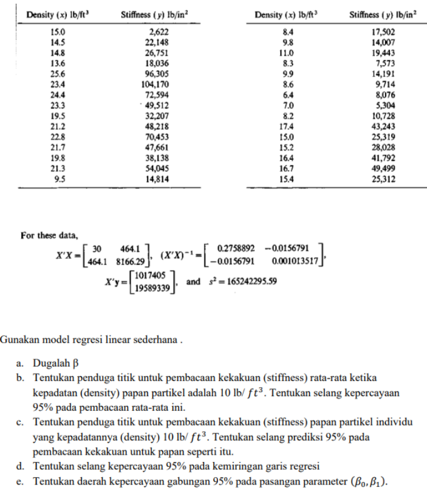

```{=html}
<style>
.centered-text {
  text-align: center;
}
</style>
```
```{r setup, warning=FALSE, include=FALSE, message = FALSE}
#                      -=( Install & Load Package Function )=-
install_load <- function (package1, ...)  {   

   # convert arguments to vector
   packages <- c(package1, ...)

   # start loop to determine if each package is installed
   for(package in packages){

       # if package is installed locally, load
       if(package %in% rownames(installed.packages()))
          do.call('library', list(package))

       # if package is not installed locally, download, then load
       else {
          install.packages(package)
          do.call("library", list(package))
       }
   } 
}

install_load('officedown','officer','tidyverse')

knitr::opts_chunk$set(
  echo=FALSE,
  #Table Captioning
  tab.cap.style="Table Caption",
  tab.cap.pre="Tabel ",
  tab.cap.sep=": ",
  #Figure Captioning
  fig.cap.style="Image Caption",
  fig.cap.pre="Figure ",
  fig.cap.sep=": "
)

rdocx_document(
  base_format = "rmarkdown::word_document",
  reference_num = FALSE
)
```

$$
\text{ }
$$

$$
\text{ }
$$

$$
\text{ }
$$

$$
\text{ }
$$

{width="729"}

$$
\text{ }
$$

$$
\text{ }
$$

$\text{ }\text{ }\text{ }\text{ }\text{ }\text{ }\text{ }\text{ }\text{ }\text{ }\text{ }\text{ }\text{ }\text{ }\text{ }\text{ }\text{ }\text{ }\text{ }\text{ }\text{ }\text{ }\text{ }\text{ }\text{ }\text{ }\text{ }\text{ }\text{ }\text{ }\text{ }\text{ }\text{ }\text{ }\text{ }\text{ }\text{ }\text{ }\text{ }\text{ }\text{ }\text{ }\text{ }\text{ }$

$$
\text{ }
$$

$$
\text{ }
$$

$$
\textbf{DEPARTEMEN STATISTIKA DAN SAINS DATA}
$$

$$
\textbf{FAKULTAS ILMU PENGETAHUAN ALAM}
$$

$$
\textbf{IPB UNIVERSITY}
$$

$$
\textbf{2023}
$$

\newpage

## Daftar Isi

```{r, echo=FALSE}
block_toc()
```

\newpage

# Soal 1


## Input data

```{r}
x0 <- rep(1,10)
x1 <- c(10,2,4,6,8,7,4,6,7,6) 
x2 <- c(7,3,2,4,6,5,3,3,4,3)
y <- c(23,7,15,17,23,22,10,14,20,19) 
X <- matrix(c(x0,x1,x2),10,3,F)
n <- nrow(X) 
```

## a.)

> Tunjukkan bahwa modle tersebut merupakan model penuh

Suatu model dikatakan model penuh jika rank matriks tersebut sama dengan $k+1$ atau $r(\mathbf{x})=k+1$.

```{r}
r.X <- qr(X)$rank 
k.1 <- ncol(X) 
cat("r(x) =",r.X); cat("\nk+1 =",k.1)
if(r.X==k.1){
  cat("\nModel merupakan model penuh")
} else{
  cat("\nModel bukan model penuh")
}
```

Terlihat bahwa model merupakan model penuh karena $r(\mathbf{x})=3$ yang sama dengan $k+1=3$.

## b.)

> Dugalah parameter tersebut

Untuk menduga parameter, digunakan formula $\mathbf{b}=(\mathbf{X}'\mathbf{X})^{-1}\mathbf{X}'y$.

```{r}
b <- solve(t(X) %*% X) %*% t(X) %*% y 
cat("Parameter duga b adalah\n"); b
```

Sehingga matriks parameter duga nya adalah $\mathbf{b}=\begin{bmatrix} 3.92 \\ 2.49 \\ -0.47 \end{bmatrix}$.

## c.) 

> Hitung penduga tak bisa bagi ragam

Penduga tak bias bagi ragam didapat menggunakan rumus sebagai berikut:

$$
s^2=\frac{(\mathbf{y}-\mathbf{X}'\mathbf{b})(\mathbf{y}-\mathbf{X}\mathbf{b})}{n-(k+1)}
$$

```{r}
s2 <- t(y - X %*% b) %*% (y - X %*% b) / (n - k.1) 
cat("Penduga tak bias bagi ragam (s^2) adalah", s2)
```

Sehingga nilai $s^2=6.36$.

\newpage

# Soal 2



## Input data

```{r}
tXX <- matrix(c(30, 464.1, 464.1, 8166.26), 2,2,T) 
inv.X <- solve(tXX)
tXy <- c(1017405, 19589339) 
s2 <- 165242295.59
n = 30 
p = 2
```

## a.) 

> Dugalah $\beta$

Untuk menduga parameter $\beta$, digunakan formula $\mathbf{b}=(\mathbf{X}'\mathbf{X})^{-1}\mathbf{X}'y$.
