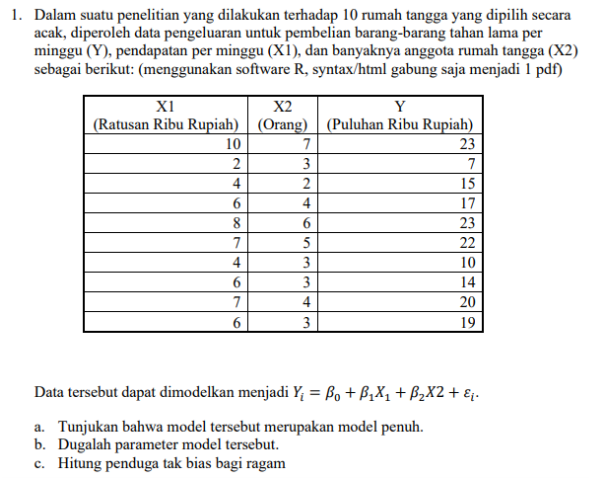

```{r, warning=FALSE, message = FALSE}
#                      -=( Install & Load Package Function )=-
install_load <- function (package1, ...)  {   

   # convert arguments to vector
   packages <- c(package1, ...)

   # start loop to determine if each package is installed
   for(package in packages){

       # if package is installed locally, load
       if(package %in% rownames(installed.packages()))
          do.call('library', list(package))

       # if package is not installed locally, download, then load
       else {
          install.packages(package)
          do.call("library", list(package))
       }
   } 
}

#Path Function
path <- function(){
  gsub  ( "\\\\",  "/",  readClipboard ()  )
}
#Copy path, Panggil function di console
#Copy r path, paste ke var yang diinginkan
```

# Soal 1



## a.) 

> Tunjukkan bahwa modle tersebut merupakan model penuh

Suatu model dikatakan model penuh jika rank matriks tersebut sama dengan $k+1$.
