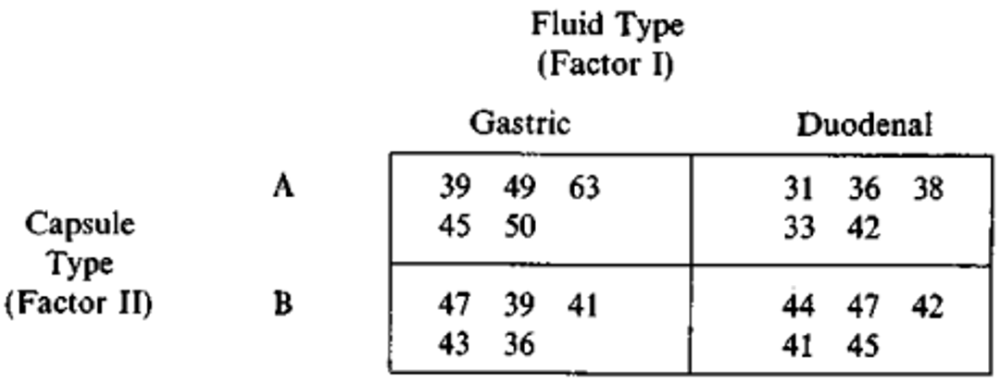

```{=html}
<style>
.centered-text {
  text-align: center;
}
</style>
```
```{r setup, warning=FALSE, include=FALSE, message = FALSE}
#                      -=( Install & Load Package Function )=-
install_load <- function (package1, ...)  {   

   # convert arguments to vector
   packages <- c(package1, ...)

   # start loop to determine if each package is installed
   for(package in packages){

       # if package is installed locally, load
       if(package %in% rownames(installed.packages()))
          do.call('library', list(package))

       # if package is not installed locally, download, then load
       else {
          install.packages(package)
          do.call("library", list(package))
       }
   } 
}

install_load('officedown','officer','tidyverse')

knitr::opts_chunk$set(
  echo=FALSE,
  #Table Captioning
  tab.cap.style="Table Caption",
  tab.cap.pre="Tabel ",
  tab.cap.sep=": ",
  #Figure Captioning
  fig.cap.style="Image Caption",
  fig.cap.pre="Figure ",
  fig.cap.sep=": "
)

rdocx_document(
  base_format = "rmarkdown::word_document",
  reference_num = FALSE
)
```

$$
\text{ }
$$

$$
\text{ }
$$

$$
\text{ }
$$

$$
\text{ }
$$

{width="729"}

$$
\text{ }
$$

$$
\text{ }
$$

$\text{ }\text{ }\text{ }\text{ }\text{ }\text{ }\text{ }\text{ }\text{ }\text{ }\text{ }\text{ }\text{ }\text{ }\text{ }\text{ }\text{ }\text{ }\text{ }\text{ }\text{ }\text{ }\text{ }\text{ }\text{ }\text{ }\text{ }\text{ }\text{ }\text{ }\text{ }\text{ }\text{ }\text{ }\text{ }\text{ }\text{ }\text{ }\text{ }\text{ }\text{ }\text{ }\text{ }\text{ }$

$$
\text{ }
$$

$$
\textbf{DEPARTEMEN STATISTIKA DAN SAINS DATA}
$$

$$
\textbf{FAKULTAS ILMU PENGETAHUAN ALAM}
$$

$$
\textbf{IPB UNIVERSITY}
$$

$$
\textbf{2023}
$$

\newpage

## Daftar Isi

```{r, echo=FALSE}
block_toc()
```

\newpage

# Soal no 1

Sebuah studi tentang kelarutan dua persiapan enzim yang paling umum dilakukan. **Tujuan** dari penelitian ini adalah untuk menentukan efek jenis kapsul dan cairan biologis pada waktu yang diperlukan agar kapsul larut. Dua cairan biologis, lambung, dan duodenum, dan dua jenis kapsul, A dan B, digunakan dalam penelitian ini. Empat sampel identik dari persiapan diperoleh. Dua dipilih secara acak untuk enkapsulasi dalam kapsul tipe A; Yang lain dienkapsulasi dalam tipe B. Salah satu dari masing -masing jenis kapsul kemudian dipilih secara acak dan dilarutkan dalam jus lambung; Yang lain dilarutkan dalam jus duodenum. Data yang diperoleh dengan beberapa kali pengulangan:



## Point (a)

> Ujilah hipotesis $H_0$ : $\tau_1=\tau_2$ dan $H_0$ : $\beta_1=\beta_2$ pada taraf nyata $5\%$

```{r, include=FALSE}
y <- matrix(c(39, 49, 63, 45, 50, 47, 39, 41, 43, 36, 31, 36, 38, 33, 42, 44, 47, 42, 41, 45), 20, 1, T )
X <- matrix(c(rep(1, length(y)), #Intersep
              #Col 1
              rep(1, length(y)/2),
              rep(0, length(y)/2),
              #Col 2
              rep(0, length(y)/2),
              rep(1, length(y)/2),
              #Col 3
              rep(1, length(y)/4),
              rep(0, length(y)/4),
              rep(1, length(y)/4),
              rep(0, length(y)/4),
              #Col 4
              rep(0, length(y)/4),
              rep(1, length(y)/4),
              rep(0, length(y)/4),
              rep(1, length(y)/4),
              #Col 5
              rep(1, length(y)/4),
              rep(0, length(y)*3/4),
              #Col 6
              rep(0, length(y)/4),
              rep(1, length(y)/4),
              rep(0, length(y)*2/4),
              #Col 7
              rep(0, length(y)*2/4),
              rep(1, length(y)/4),
              rep(0, length(y)/4),
              #Col 8
              rep(0, length(y)*3/4),
              rep(1, length(y)/4)
              ), length(y), 9, F)
n <- 5
```

### **Hipotesis**

**Faktor 1: Cairan biologis**

> $H_0$ : Faktor cairan biologis tidak berpengaruh nyata terhadap waktu yang diperlukan agar kapsul larut
>
> $H_1$ : Faktor cairan biologis berpengaruh nyata terhadap waktu yang diperlukan agar kapsul larut

**Faktor 2: Jenis kapsul**

> $H_0$ : Faktor jenis kapsul tidak berpengaruh nyata terhadap waktu yang diperlukan agar kapsul larut
>
> $H_1$ : Faktor jenis kapsul berpengaruh nyata terhadap waktu yang diperlukan agar kapsul larut

**Faktor 3: Faktor interaksi cairan biologis dan jenis kapsul**

> $H_0$ : Faktor interaksi antara cairan biologis dan jenis kapsul tidak berpengaruh nyata terhadap waktu yang diperlukan agar kapsul larut
>
> $H_1$ : Faktor interaksi antara cairan biologis dan jenis kapsul berpengaruh nyata terhadap waktu yang diperlukan agar kapsul larut

### Tabel ANOVA

### Membandingkan F-hitung dengan F-tabel

### **Kesimpulan**

## Point(b)

> Ujilah interaksi antara Faktor 1 dan 2 menggunakan metode **matriks kebalikan umum** pada taraf nyata $5\%$

### **Hipotesis**

> $H_0:\left(\left(\tau\beta\right)_{11}-\left(\tau\beta\right)_{12}\right)-\left(\left(\tau\beta\right)_{21}-\left(\tau\beta\right)_{22}\right)=0$
>
> $H_1:\left(\left(\tau\beta\right)_{11}-\left(\tau\beta\right)_{12}\right)-\left(\left(\tau\beta\right)_{21}-\left(\tau\beta\right)_{22}\right)\neq0$

### Penyelesaian

**Hasil dari R**

```{r}
cat("Vektor y :\n"); y
cat("\n\nMatriks X :\n"); X

tXX <- t(X) %*% X
cat("\n\nX'X :\n"); tXX

tXy <- t(X) %*% y
cat("\n\nX'y :\n"); tXy

install_load("MASS")
M1 <- matrix(tXX[6:9, 6:9], 4,4,T)
tXX.c1 <- matrix(0, 9, 9)
tXX.c1[6:9, 6:9] <- t(solve(M1))
cat("\n(X'X)^c :\n"); fractions(tXX.c1)

b <- tXX.c1 %*% tXy; cat("\nb :\n"); b
```

```{r}
#SSres
SSres <- t(y) %*% ( diag(1,20,20) - X %*% tXX.c1 %*% t(X) ) %*% y; cat("SSres :", SSres)

#s^2
r <- qr(tXX)$rank
s2 <- SSres/(n-r); cat("\n\ns^2 :", s2)
```

```{r}
C <- matrix(c(0, 0, 0, 0, 0, 1, -1, -1, 1), 1, 9, T); cat("C :\n"); C
m <- 1
Fhit <- ( t(C %*% b) %*% solve(C %*% tXX.c1 %*% t(C)) %*% C %*% b /m )/s2
cat("Fhit :", Fhit, "\nFtab :", qf(1 - 0.05, 1, 5-4) )
```

Keputusan : $F_{hit}=0.6523<F_{tabel}=161.45$ maka tak tolak $H_0$

## Point (c)

> Ujilah **interaksi** antara Faktor 1 dan 2 menggunakan metode **reparameterisasi** pada taraf nyata $5\%$

# Soal no 2

Sebuah studi terkait metode belajar siswa dilakukan dengan perlakuan berupa penerapan 4 metode belajar yang berbeda yaitu konvensional, auditori, kinestetik, dan visual. Sementara respon berupa nilai ujian akhir semester (UAS) dari masing-masing siswa tersebut dan diberikan pula covariate berupa nilai ujian tengah semester (UTS). Berikut adalah datanya.

### Kesimpulan 

Tak tolak $H_0$ (terima $H_0$). Artinya, faktor interaksi antara cairan biologis dan jenis kapsul tidak berpengaruh nyata terhadap waktu yang diperlukan agar kapsul larut pada taraf nyata $5\%$.

**Persamaan dalam bentuk Matriks**

$$
y = \mathbf{X}\beta + \varepsilon
$$

$$
\begin{bmatrix} y_{11} \\ y_{12} \\ y_{13} \\ y_{21} \\ y_{23} \\ y_{23} \end{bmatrix} = \begin{bmatrix} 1 & 1 & 0 \\  1 & 1 & 0 \\ 1 & 1 & 0 \\ 1 & 0 & 1 \\ 1 & 0 & 1 \\ 1 & 0 & 1 \\ \end{bmatrix} \begin{bmatrix} \mu \\ \tau_1 \\ \tau_2 \end{bmatrix} + \begin{bmatrix} \varepsilon_{11} \\ \varepsilon_{12} \\ \varepsilon_{13} \\ \varepsilon_{21} \\ \varepsilon_{23} \\ \varepsilon_{23} \end{bmatrix}
$$

$$
\begin{bmatrix} 8.95 \\ 7.81 \\ 7.5 \\ 5.81 \\ 7.30 \\ 7.60 \\ \end{bmatrix} = \begin{bmatrix} 1 & 1 & 0 \\  1 & 1 & 0 \\ 1 & 1 & 0 \\ 1 & 0 & 1 \\ 1 & 0 & 1 \\ 1 & 0 & 1 \\ \end{bmatrix} \begin{bmatrix} \mu \\ \tau_1 \\ \tau_2 \end{bmatrix} + \begin{bmatrix} \varepsilon_{11} \\ \varepsilon_{12} \\ \varepsilon_{13} \\ \varepsilon_{21} \\ \varepsilon_{23} \\ \varepsilon_{23} \end{bmatrix}
$$

Dimana :

-   $y$ : vektor respons

-   $\mathbf{X}$ : matriks rancangan

-   $\beta$ : vektor parameter

-   $\varepsilon$ : vektor galat

**Persamaan normal**

$$
y_{ij} = \mu + \tau_i + \varepsilon_{ij} \text{ } ; \text{ } i = 1, 2 \text{ dan } j=1,2,3
$$

Dimana :

-   $y_{ij}$ : respons perlakuan (pada perlakuan ke-$i$ dan ulangan ke-$j$ )

-   $\mu$ : rataan umum

-   $\tau_i$ : pengaruh perlakuan (pada perlakuan ke-$i$ )

-   $\varepsilon_{ij}$ : pengaruh acak (pada perlakuan ke-$i$ dan ulangan ke-$j$ )

```{r, include=FALSE}
y <- c(8.95, 7.81, 7.5, 5.81, 7.3, 7.6)
X <- matrix(c(1, 1, 0,
              1, 1, 0,
              1, 1, 0,
              1, 0, 1,
              1, 0, 1,
              1, 0, 1), 6, 3, T)
n <- nrow(X)
```

## Point (b)

> Hitunglah **penduga kuadrat terkecil** bagi beda pengaruh `Mesin A` dan `Mesin B`.

**Hasil dari R**

```{r message=FALSE, warning=FALSE}
#X'X
tXX <- t(X) %*% X; cat("X'X :\n"); tXX

#(X'X)^c
install_load("MASS")
M1 <- matrix(c(3, 0, 
               0, 3), 2,2,T)
tXX.c1 <- matrix(0, nrow = 3, ncol = 3)
tXX.c1[2:3, 2:3] <- t(solve(M1))
cat("\n(X'X)^c :\n"); fractions(tXX.c1)

#X'y 
tXy <- t(X) %*% y; cat("\nX'y :\n"); tXy

#Beta
Beta <- tXX.c1 %*% tXy; cat("\nBeta :\n"); Beta
```

**Dalam Latex**

$$
\begin{equation}
\begin{aligned}
\mathbf{X}'\mathbf{X} &= \begin{bmatrix} 6 & 3 & 3 \\ 3 & 3 & 0 \\ 3 & 0 & 3 \\ \end{bmatrix} \\ \\ (\mathbf{X}'\mathbf{X})^c &= \begin{bmatrix} 0 & 0 & 0 \\ 0 & \frac{1}{3} & 0 \\ 0 & 0 & \frac{1}{3} \\ \end{bmatrix} \\ \\ \mathbf{X}'\mathbf{y} &= \begin{bmatrix} 44.97 \\ 24.26 \\ 20.71 \\\end{bmatrix} \\ \\ \beta &= (\mathbf{X}'\mathbf{X})^c \mathbf{X}'\mathbf{y} \\ &= \begin{bmatrix} 0 & 0 & 0 \\ 0 & \frac{1}{3} & 0 \\ 0 & 0 & \frac{1}{3} \\ \end{bmatrix}  \begin{bmatrix} 44.97 \\ 24.26 \\ 20.71 \\ \end{bmatrix} \\ &= \begin{bmatrix} 0 \\ 8.0866 \\ 6.9033 \\ \end{bmatrix}
\end{aligned}
\end{equation}
$$

## Point (c)

> Tentukan penduga ragam $\tau_1 – \tau_2$

**Hasil dari R**

```{r}
#SSres
SSres <- t(y) %*% ( diag(1,6,6) - X %*% tXX.c1 %*% t(X) ) %*% y; cat("SSres :", SSres)

#s^2
r <- qr(tXX)$rank
s2 <- SSres/(n-r); cat("\n\ns^2 :", s2)
```

**Dalam Latex**

$$
\begin{equation}
\begin{aligned}SS_{res} &= y'[\mathbf{I} - \mathbf{X} (\mathbf{X}' \mathbf{X})^c \mathbf{X}']y \\  &= \begin{bmatrix} 8.95 & 7.81 & 7.5 & 5.81 & 7.30 & 7.60  \end{bmatrix} \left[ \mathbf{I} - \begin{bmatrix} 1 & 1 & 0 \\  1 & 1 & 0 \\ 1 & 1 & 0 \\ 1 & 0 & 1 \\ 1 & 0 & 1 \\ 1 & 0 & 1 \\ \end{bmatrix} \begin{bmatrix} 0 & 0 & 0 \\ 0 & \frac{1}{3} & 0 \\ 0 & 0 & \frac{1}{3} \\ \end{bmatrix} \begin{bmatrix} 1 & 1 & 1 & 1 & 1 & 1 \\ 1 & 1 & 1 & 0 & 0 & 0 \\ 0 & 0 & 0 & 1 & 1 & 1 \end{bmatrix} \right] \begin{bmatrix} 8.95 \\ 7.81 \\ 7.5 \\ 5.81 \\ 7.30 \\ 7.60 \\ \end{bmatrix} \\ &= 3.004133
\end{aligned} 
\end{equation}
$$

Penduga ragam galat

$$
\begin{equation}
\begin{aligned} s^2 &= \frac{SS_{res}}{n-r} \\ &= \frac{3.004133}{6-2} \\ &= 0.7510333
\end{aligned}
\end{equation}
$$

## Point (d)

> Apakah $\tau_1 - \tau_2$ estimable?

**Hasil dari R**

```{r}
c(0, 1, -1) %*% tXX.c1 %*% tXX
```

$$
\begin{equation}
\begin{aligned}\tau_1 - \tau_2 = t'\beta &= \begin{bmatrix} 0 & 1 & -1 \end{bmatrix} \begin{bmatrix} \mu \\ \tau_1 \\ \tau_2 \end{bmatrix} \\ t'(\mathbf{X}' \mathbf{X})^c(\mathbf{X}' \mathbf{X}) &= \begin{bmatrix} 0 & 1 & -1 \end{bmatrix}  \begin{bmatrix} 0 & 0 & 0 \\ 0 & \frac{1}{3} & 0 \\ 0 & 0 & \frac{1}{3} \\ \end{bmatrix} \begin{bmatrix} 6 & 3 & 3 \\ 3 & 3 & 0 \\ 3 & 0 & 3 \\ \end{bmatrix} \\ &= \begin{bmatrix} 0 & 1 & -1 \end{bmatrix} \end{aligned} 
\end{equation}
$$

Karena $t' =t'(\mathbf{X}' \mathbf{X})^c(\mathbf{X}' \mathbf{X})$ maka $\tau_1 - \tau_2$ **estimable**.

## Point (e)

> Apakah $H_0$ : $\tau_1 – \tau_2$ testable?

Cek syarat testable :

1.  $\mathbf{C}\beta$ estimable\
    Dimana $\mathbf{C}=\begin{bmatrix} 0 & 1 & -1 \end{bmatrix}$ , $\beta=\mathbf{H} = (\mathbf{X}' \mathbf{X})^c(\mathbf{X}' \mathbf{X})$\
    Karena matriks $\mathbf{C}$ sama dengan vektor $t'$ pada **point (d)**, maka dapat dipastikan bahwa $\mathbf{C}\beta$ estimable.

2.  Vektor-vektor baris pada matriks $\mathbf{C}$ saling bebas\
    Karena matriks $\mathbf{C}$ merupakan vektor baris, maka dapat dinyatakan vektor-vektor baris pada matriks $\mathbf{C}$ saling bebas.

    $$
    \begin{equation}\begin{aligned} a_1 \begin{bmatrix} 0 \\ 1 \\ -1 \end{bmatrix} &= \begin{bmatrix} 0 \\ 0 \\ 0 \end{bmatrix} \\ \begin{bmatrix} 0 \\ a_1 \\ -a_1 \end{bmatrix} &= \begin{bmatrix} 0 \\ 0 \\ 0 \end{bmatrix} \end{aligned} \end{equation}
    $$\
    Atau dapat dinyatakan dengan $a_1 = -a_1 = 0$, yang artinya saling bebas.

Karena semua syarat testable terpenuni, maka $H_0$ : $\tau_1 – \tau_2$ testable.

## Point (f)

> Lakukan pengujian hipotesis pada point (e) dengan taraf nyata $0.05$.

**Hasil dari R**

```{r}
C <- matrix(c(0, 1, -1), 1, 3, T)
m <- 1
Fhit <- ( t(C %*% Beta) %*% solve(C %*% tXX.c1 %*% t(C)) %*% C %*% Beta /m )/s2
cat("Fhit :", Fhit, "\nFtab :", qf(1 - 0.05, 1, 4) )
```

$$
\begin{equation}\begin{aligned} F_{hit} &= \frac{ (\mathbf{C}\beta)' (\mathbf{C} (\mathbf{X}'\mathbf{X})^c \mathbf{C}')^{-1} \mathbf{C}\beta/m} {s^2} \\ \\ \mathbf{C} &= \begin{bmatrix} 0 & 1 & -1 \end{bmatrix} \text{ ; } \beta = \begin{bmatrix} 0 \\ 8.0866 \\ 6.9033 \\ \end{bmatrix} \\ \\  F_{hit} &=  \frac{ \dfrac{\left( \begin{bmatrix} 0 & 1 & -1 \end{bmatrix} \begin{bmatrix} 0 \\ 8.0866 \\ 6.9033 \\ \end{bmatrix}\right)' \left( \begin{bmatrix} 0 & 1 & -1 \end{bmatrix} \begin{bmatrix} 0 & 0 & 0 \\ 0 & \frac{1}{3} & 0 \\ 0 & 0 & \frac{1}{3} \\ \end{bmatrix} \begin{bmatrix} 0 \\ 1 \\ -1 \end{bmatrix} \right)^{-1} \begin{bmatrix} 0 \\ 8.0866 \\ 6.9033 \\ \end{bmatrix} } {1} }{0.7510333} \\ F_{hit} &= 2.796702 \end{aligned} \end{equation}
$$

Sedangkan $F_{(1;4)0.05} = 7.708647$ yang lebih besar dari $F_{hit}$.

## Point (g)

> Kesimpulan

Karena $F_{hit} < F_{(1;4)0.05}$, maka tolak $H_0$. Artinya Tidak cukup bukti untuk menyatakan bahwa terdapat pengaruh minimal satu dari kedua mesin terhadap hasil produksi pada taraf nyata 5%.

# Soal no 2

Suatu percobaan bertujuan untuk mengetahui pengaruh dosis fumigant terhadap daya kecambah benih kacang hijau. **Dosis** fumigant yang diberikan ada **dua**: $32 gr/m^3$ dan $64 gr/m^3$ dengan **3 ulangan**. Data yang diperoleh sebagai berikut:


## Point (a)

> Jika rancangan yang digunakan adalah RAL, tuliskan model liner dalam bentuk matriks besera keterangannya. Tunjukkan cara memperolehnya.

**Model dalam bentuk matriks**

$$
y = \mathbf{X}\beta + \varepsilon
$$

$$
\begin{bmatrix} y_{11} \\ y_{12} \\ y_{13} \\ y_{21} \\ y_{23} \\ y_{23} \end{bmatrix} = \begin{bmatrix} 1 & 1 & 0 \\  1 & 1 & 0 \\ 1 & 1 & 0 \\ 1 & 0 & 1 \\ 1 & 0 & 1 \\ 1 & 0 & 1 \\ \end{bmatrix} \begin{bmatrix} \mu \\ \tau_1 \\ \tau_2 \end{bmatrix} + \begin{bmatrix} \varepsilon_{11} \\ \varepsilon_{12} \\ \varepsilon_{13} \\ \varepsilon_{21} \\ \varepsilon_{23} \\ \varepsilon_{23} \end{bmatrix}
$$

$$
\begin{bmatrix} 90 \\ 88 \\ 92 \\ 90 \\ 80 \\ 78 \end{bmatrix} = \begin{bmatrix} 1 & 1 & 0 \\  1 & 1 & 0 \\ 1 & 1 & 0 \\ 1 & 0 & 1 \\ 1 & 0 & 1 \\ 1 & 0 & 1 \\ \end{bmatrix} \begin{bmatrix} \mu \\ \tau_1 \\ \tau_2 \end{bmatrix} + \begin{bmatrix} \varepsilon_{11} \\ \varepsilon_{12} \\ \varepsilon_{13} \\ \varepsilon_{21} \\ \varepsilon_{23} \\ \varepsilon_{23} \end{bmatrix}
$$

Dimana :

-   $y$ : vektor respons

-   $\mathbf{X}$ : matriks rancangan

-   $\beta$ : vektor parameter

-   $\varepsilon$ : vektor galat

**Model linier**

$$ y_{ij} = \mu + \tau_i + \varepsilon_{ij} \text{ } ; \text{ } i = 1, 2 \text{ dan } j=1,2,3 $$

Dimana :

-   $y_{ij}$ : respons perlakuan (pada perlakuan ke-$i$ dan ulangan ke-$j$ )

-   $\mu$ : rataan umum

-   $\tau_i$ : pengaruh perlakuan (pada perlakuan ke-$i$ )

-   $\varepsilon_{ij}$ : pengaruh acak (pada perlakuan ke-$i$ dan ulangan ke-$j$ )

**Cara memperoleh**

1.  Vektor respons $y$ diperoleh dari data respon pada tabel yakni dari dosis $i$ ( $32 gr/m^3$ dan $64 gr/m^3$ ) dan ulangan $j$ (1, 2, dan 3). Contoh :\
    $y_{11}$ : Dosis $32 gr/m^3$, ulangan ke-1. $y_{23}$ : Dosis $64 gr/m^3$ ulangan ke-3.\
    
2.  Matriks $\mathbf{X}$ diperoleh mirip seperi mencari dummy variabel.\
    {width="250"}
3.  Matriks $\beta$ terdiri dari $\mu$ (rataan umum), $\tau_1$ (pengaruh perlakuan 1) , dan $\tau_2$ (pengaruh perlakuan 2)
4.  Matriks $\varepsilon$ atau pengaruh acak, jumlah dan index nya sesuai dengan matriks $y$.

```{r, include=FALSE}
y <- c(90, 88, 92, 90, 80, 78)
X <- matrix(c(1, 1, 0,
              1, 1, 0,
              1, 1, 0,
              1, 0, 1,
              1, 0, 1,
              1, 0, 1), 6, 3, T)
n <- nrow(X)
```

## Point (b)

> Tunjukkan bahwa persamaan normal untuk model ini adalah persamaan yang konsisten.

**Hasil dari R**

```{r message=FALSE, warning=FALSE}
#X'X
tXX <- t(X) %*% X; cat("X'X :\n"); tXX

#(X'X)^c
install_load("MASS")
M1 <- matrix(c(3, 0, 
               0, 3), 2,2,T)
tXX.c1 <- matrix(0, nrow = 3, ncol = 3)
tXX.c1[2:3, 2:3] <- t(solve(M1))

#X'y 
tXy <- t(X) %*% y; cat("\nX'y :\n"); tXy

#(X'X)|(X'y)
tXX.tXy <- matrix(c(tXX, tXy), 3, 4, F); cat("\n(X'X)|(X'y) :\n"); tXX.tXy  

#rank(X'X)
cat("\n\nrank(X'X) :", qr(tXX)$rank)

#rank(X'y)
cat("\n\nrank{(X'X)|(X'y)} :", qr(tXX.tXy)$rank )
```

Sistem Persamaan Linier disebut konsisten jika $r(\mathbf{A}|\mathbf{B}) = r(\mathbf{A})$. Dimana SPL : $\mathbf{A}\mathbf{x}=\mathbf{B}$

Dalam Model Linier bentuknya menjadi : $(\mathbf{X}'\mathbf{X}) \mathbf{b} = \mathbf{X}'\mathbf{y}$. Sehingga persamaan disebut konsisten jika $r(\mathbf{X}'\mathbf{X}|\mathbf{X}'\mathbf{y}) = r(\mathbf{X}'\mathbf{X})$.

$$
\begin{equation}
\begin{aligned}
r(\mathbf{X}'\mathbf{X}) & = r\begin{pmatrix}  6 & 3 & 3 \\ 3 & 3 & 0\\ 3 & 0 & 3 \end{pmatrix} \overset{\text{E}31(-1)}{\underset{\text{E}32(1)}{\longrightarrow}} r\begin{pmatrix} 6 & 3 & 3 \\ 3 & 3 & 0\\ 0 & 0 & 0 \end{pmatrix} \\ &=2 \\ \\ r(\mathbf{X}'\mathbf{X}|\mathbf{X}'\mathbf{y}) & = r\begin{pmatrix} \begin{array}{ccc|c} 6 & 3 & 3 & 518 \\ 3 & 3 & 0 & 270\\ 3 & 0 & 3 & 248 \end{array}\end{pmatrix} \overset{\text{E}31(-1)}{\underset{\text{E}32(1)}{\longrightarrow}} r\begin{pmatrix} \begin{array}{ccc|c} 6 & 3 & 3 & 518 \\ 3 & 3 & 0 & 270\\ 0 & 0 & 0 & 0 \end{array}\end{pmatrix} \\ &=2 \\ \\ r(\mathbf{X}'\mathbf{X}) & = r(\mathbf{X}'\mathbf{X}|\mathbf{X}'\mathbf{y})
\end{aligned}
\end{equation}
$$

Sehingga Persamaan normal pada model ini terbukti konsisten.

## Point (c)

> Tunjukkan bahwa beda pengaruh dosis 32 dan 64 merupakan fungsi linier dari parameter yang dapat diduga (estimable).

**Hasil dari R**

```{r}
cat("(X'X)^c:\n"); fractions(tXX.c1)
cat("\nTau_1 - Tau_2 :\n")
c(0, 1, -1) %*% tXX.c1 %*% tXX
```

Dosis 32 = $\tau_1$, dosis 64 = $\tau_2$. Sehingga akan dicek apakah $\tau_1 - \tau_2$ estimable?

$$ \begin{equation} \begin{aligned}\tau_1 - \tau_2 = t'\beta &= \begin{bmatrix} 0 & 1 & -1 \end{bmatrix} \begin{bmatrix} \mu \\ \tau_1 \\ \tau_2 \end{bmatrix} \\ t'(\mathbf{X}' \mathbf{X})^c(\mathbf{X}' \mathbf{X}) &= \begin{bmatrix} 0 & 1 & -1 \end{bmatrix}  \begin{bmatrix} 0 & 0 & 0 \\ 0 & \frac{1}{3} & 0 \\ 0 & 0 & \frac{1}{3} \\ \end{bmatrix} \begin{bmatrix} 6 & 3 & 3 \\ 3 & 3 & 0 \\ 3 & 0 & 3 \\ \end{bmatrix} \\ &= \begin{bmatrix} 0 & 1 & -1 \end{bmatrix} \end{aligned}  \end{equation} $$

Karena $t' =t'(\mathbf{X}' \mathbf{X})^c(\mathbf{X}' \mathbf{X})$ maka $\tau_1 - \tau_2$ **estimable**.
