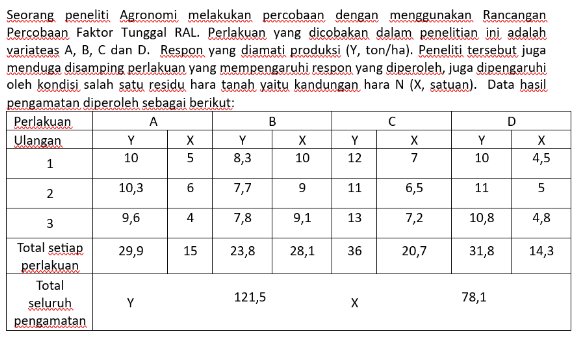
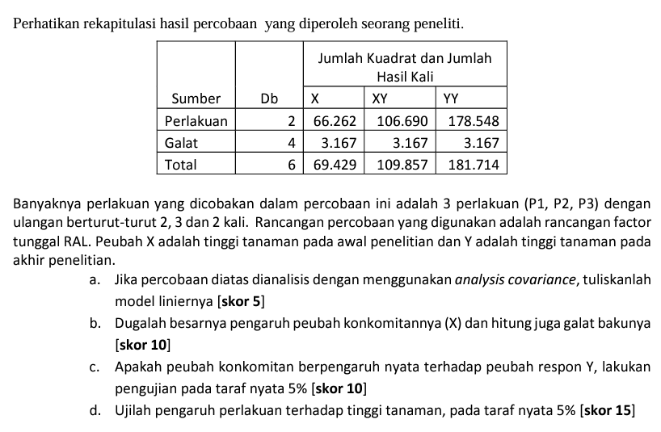

```{r setup, warning=FALSE, include=FALSE, message = FALSE}
#                      -=( Install & Load Package Function )=-
install_load <- function (package1, ...)  {   

   # convert arguments to vector
   packages <- c(package1, ...)

   # start loop to determine if each package is installed
   for(package in packages){

       # if package is installed locally, load
       if(package %in% rownames(installed.packages()))
          do.call('library', list(package))

       # if package is not installed locally, download, then load
       else {
          install.packages(package)
          do.call("library", list(package))
       }
   } 
}

install_load('officedown','officer','tidyverse')
```

Data pengamatan pada tabel dibawah, merupakan daya kecambah (%) benih kacang hijau pada dosis fumigant (0, 32 dan 64) pada 3 periode waktu pengamatan.


Jika model linier yang digunakan untuk menganalisis data tersebut adalah model dua arah tanpa interaksi. Jawablah pertanyaan-pertanyaan berikut: $y_{ij}=\mu +\alpha_i +\beta_j +\varepsilon_{ijk}$, dengan $\alpha_i$ pengaruh dosis fumigan ke-i, $\beta_j$ pengaruh periode waktu ke-j

```{r message=FALSE, warning=FALSE}
install_load("DT","dplyr")
data <- data.frame(
  Dosis = rep(c("0", "32", "64"), each = 3),
  Hari.ke = rep(c("1", "2", "3"), times=3, each =1),
  y = c(95, 100, 100, 
        90, 95, 97, 
        80, 82, 85)
)
a <- length(unique(data$Dosis))
b <- length(unique(data$Hari.ke))
n <- nrow(data) / (a*b)

datatable(data)
```

```{r}
model <- aov(y ~ Dosis + Hari.ke, data = data)
summary(model)
```

```{r}
coef(model)
```

> No 1.

```{r}
coef(model)[2]
```

> No 2.

```{r}
coef(model)[5]
```

> No 3.

```{r}
# Model dengan hipotesis dosis
model.h <- aov(y ~ Hari.ke, data = data)

# Jumlah kuadrat hipotesis
SS.h <- sum((residuals(model))^2) - sum((residuals(model.h))^2)

SS.h
```

Atau

```{r}
X <- model.matrix(~ Dosis, data = data)
Y <- data$y

H <- X %*% solve(t(X) %*% X) %*% t(X)

beta <- as.numeric(coef(model)["Dosis32"]) 

SS.h.m <- beta * H %*% Y; SS.h.m
```

Seorang peneliti agronomi melakukan percobaan dengan menggunakan rancangan percobaan faktor tunggal ral. Perlakukan yang dicobakan dalam penelitian ini adalah varietas a, b, c, dan d. respon yang diamati produksi (y, ton/ha). Peneliti tersebut juga menduga disamping perlakuan yang mempengaruhi respon yang diperoleh, juga dipengaruhi oleh hondisi salah satu residu hara tanah yaitu kandungan hara N (X, satuan). Data hasil pengamaan diperoleh sebagai berikut :



```{r}
data <- data.frame(
  Perlakuan = rep(c("A", "B", "C", "D"), each = 3) %>% as.factor(),
  Ulangan = rep(c("1", "2", "3"), times=4, each =1)  %>% as.factor(),
  y = c(10, 10.3, 9.6, 
        8.3, 7.7, 7.8, 
        12, 11, 13,
        10, 11, 10.8),
  x = c(5, 6, 4,
        10, 9, 9.1,
        7, 6.5, 7.2, 
        4.5, 5, 4.8)
)
a <- length(unique(data$Perlakuan))
b <- length(unique(data$Ulangan))
n <- nrow(data) / (a*b)

datatable(data)
```

```{r message=FALSE, warning=FALSE}
install_load("car")
ancova.model <- aov(y ~ Perlakuan +x, data = data)
ancova_model <- Anova(ancova.model, type="III"); ancova_model
```

```{r}
coef(ancova.model)
```



```{r}
3.167 - (106.69 * 109.867)/66.262

106.69/66.262
```

```{r}
178.548/(3.167/2)
66.262/(3.167/2)
qf(1-0.05, 2,4)
```
